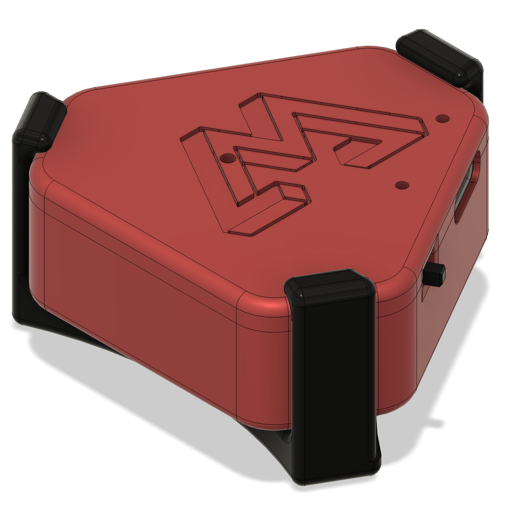
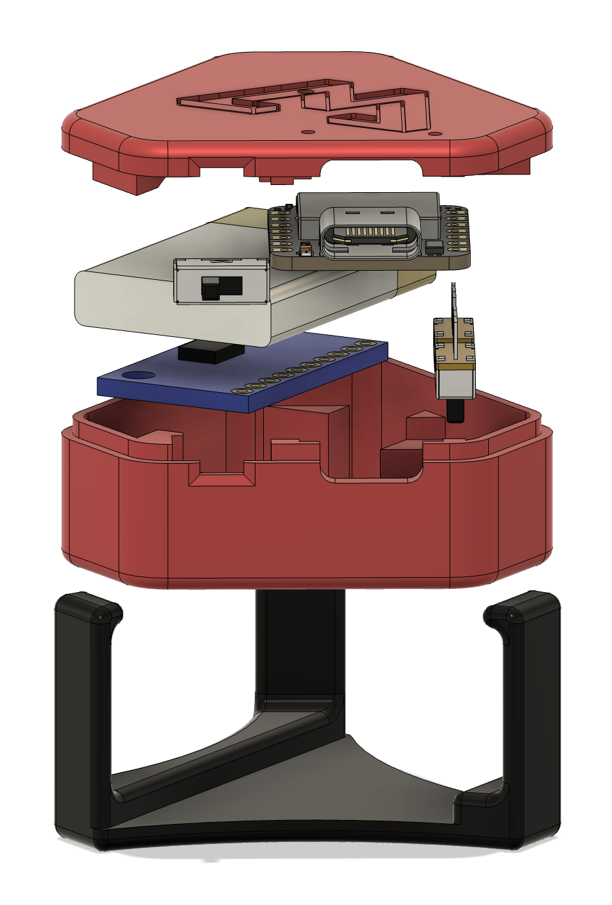

# Eidon Tracker

A complete Bluetooth IMU tracking system featuring custom hardware, 3D printed enclosure, and web-based applications. The Eidon Tracker transmits real-time quaternion orientation data over Bluetooth HID, making it perfect for motion capture, gaming, and interactive applications.

<div align="center">
  
</div>

## Features

- **High-precision IMU tracking** with BNO085 9-DOF sensor
- **Bluetooth HID device** - appears as standard input device
- **Real-time quaternion data** streaming at 1000Hz
- **Custom 3D printed enclosure** with integrated switches
- **Web-based applications** for visualization and interaction
- **Battery monitoring** with charging status
- **Device color customization** via HID feature reports

## Bill of Materials (BOM)

<div align="center">
  
</div>

### Required Components

| Component | Quantity | Description | Purchase Link |
|-----------|----------|-------------|---------------|
| [Seeed XIAO nRF52840 Sense](https://www.seeedstudio.com/XIAO-nRF52840-Sense-p-5256.html) | 1 | Main microcontroller with built-in BLE | [Amazon](https://amzn.to/4kR0hSP) |
| BNO085 IMU Breakout | 1 | 9-DOF Absolute Orientation Sensor | [Amazon](https://amzn.to/4mKZSTC) |
| LiPo Battery (3.7V) | 1 | 250mAh recommended | [Amazon](https://amzn.to/4kpmNSK) |
| Toggle Switches (6mm) | 2 | For power and position config | [Amazon](https://amzn.to/3ZfAECM) |
| 30 AWG Wires | 4x ~5cm | Female-to-female, ~20cm | [Amazon](https://amzn.to/4kB8Z7V) |

### 3D Printing Materials

| Material | Quantity | Description |
|----------|----------|-------------|
| PLA Filament | ~50g | For enclosure parts |
| Support Material | As needed | If printing with overhangs |

### Tools Required

- 3D Printer
- Soldering iron and solder
- Small screwdriver
- Wire strippers

**Estimated Total Cost**: $80-120 USD

## Hardware Setup

### Wiring Diagram

Connect the BNO085 to the XIAO nRF52840 Sense:

| BNO085 Pin | XIAO Pin | Function |
|------------|----------|----------|
| VIN | 3V3 | Power (3.3V) |
| GND | GND | Ground |
| SDA | D9 | IMU I2C Data |
| SCL | D10 | IMU I2C Clock |
| INT | D8 | IMU Interrupt (optional) |

### Switch Connections

| Switch | Output Pin | Input Pin | Function |
|--------|------------|-----------|----------|
| Left/Right | D5 | D6 | Horizontal orientation |
| Upper/Lower | D0 | D1 | Vertical orientation |

### 3D Printing

Print the following files from the `cad/` directory:

1. `eidon-tracker-base.stl` - Main enclosure base
2. `eidon-tracker-top.stl` - Enclosure lid  
3. `eidon-tracker-mount.stl` - Optional mounting bracket

**Print Settings:**
- Layer Height: 0.2mm
- Infill: 20%
- Support: Yes (for overhangs)
- Material: PLA

## Software Setup

### PlatformIO Installation

1. Install [Visual Studio Code](https://code.visualstudio.com/)
2. Install the [PlatformIO IDE extension](https://platformio.org/install/ide?install=vscode)

### Building and Uploading Firmware

1. Clone this repository:
   ```bash
   git clone https://github.com/yourusername/eidon-tracker.git
   cd eidon-tracker
   ```

2. Open the project in VSCode with PlatformIO

3. Connect your XIAO nRF52840 Sense via USB

4. Build and upload:
   ```bash
   pio run --target upload
   ```

### Dependencies

The following libraries are automatically managed by PlatformIO:

- **Adafruit BNO08x** (v1.2.3+) - IMU sensor driver
- **Adafruit BluefruitLE nRF52** - Bluetooth functionality  
- **Arduino Framework** - Core functionality

## Web Applications

The `web/` directory contains the main interactive application:

### 3D Orientation Visualizer (`index.html`)

- **Real-time 3D visualization** of tracker orientation and movement
- **Multiple camera angles** and viewing modes
- **Bluetooth HID integration** for seamless device connectivity
- **Calibration status monitoring** and quaternion data display

### Running Web Applications

Simply open `web/index.html` directly in your web browser:

1. Navigate to the `web/` directory in your file explorer
2. Double-click `index.html` to open it in your default browser
3. Or right-click and "Open with" your preferred browser (Chrome/Edge recommended for Web Bluetooth support)
4. Connect to your Eidon Tracker via Bluetooth

## HID Reports

The Eidon Tracker implements a custom HID device with multiple report types for data exchange:

### Input Report (Report ID: 1)
**Size**: 9 bytes total
- **Quaternion Data** (8 bytes): Four 16-bit values representing orientation
  - `w` component (bytes 0-1): Scalar part of quaternion
  - `x` component (bytes 2-3): X-axis rotation
  - `y` component (bytes 4-5): Y-axis rotation  
  - `z` component (bytes 6-7): Z-axis rotation
- **Switch States** (1 byte): Two button states plus padding
  - Bit 0: Left/Right switch state
  - Bit 1: Upper/Lower switch state
  - Bits 2-7: Reserved (padding)

### Output Report (Report ID: 1)
**Size**: 1 byte
- **Vendor Command**: Custom command byte for device control
  - Used for device configuration and special commands
  - Values defined in firmware for various operations

### Feature Report (Report ID: 1)  
**Size**: 3 bytes
- **RGB Color Settings**: Device LED color configuration
  - Byte 0: Red component (0-255)
  - Byte 1: Green component (0-255)
  - Byte 2: Blue component (0-255)
  - Colors are stored in device flash memory
  - Allows customization of device LED color

### HID Usage Pages
- **Primary**: Sensor Page (0x20) - Orientation Usage (0x80)
- **Secondary**: Button Page (0x09) - Button 1-2
- **Vendor**: Custom Page (0xFF00) - Vendor-specific features

## Usage

### Initial Setup

1. **Power on** the device - LED will indicate status
2. **Pair via Bluetooth** - Device appears as "Eidon Tracker XXXX"
3. **Calibrate IMU** - Wave device in figure-8 pattern until calibrated
4. **Open web application** of choice
5. **Connect** to device in web browser

### Calibration Process

The BNO085 sensor requires calibration for optimal performance:

1. **Gyroscope**: Keep device stationary for 2-3 seconds
2. **Accelerometer**: Slowly rotate through all orientations  
3. **Magnetometer**: Move device in figure-8 pattern away from magnetic interference
4. Monitor calibration status in web application or serial output

### LED Status Indicators

| LED State | Meaning |
|-----------|---------|
| Solid Blue | Connected and ready |
| Blinking Blue | Advertising/pairing mode |
| Red | Low battery or error |
| Green | Charging |

## Development

### Project Structure

```
eidon-tracker/
├── firmware/               # PlatformIO firmware project
│   ├── src/main.cpp       # Main firmware source
│   ├── platformio.ini     # PlatformIO configuration
│   └── lib/               # Custom libraries
├── web/                   # Web applications
│   ├── index.html         # 3D orientation visualizer
│   └── script.js          # Shared JavaScript libraries
├── cad/                   # 3D printing files
│   ├── eidon-tracker.f3d  # Fusion 360 source
│   ├── *.stl              # STL files for printing
│   └── *.gcode            # Pre-sliced files
├── images/                # Product photos
└── README.md              # This file
```

### Firmware Development

The firmware is built on the Arduino framework with PlatformIO. Key components:

- **HID Report Descriptor**: Custom HID device with quaternion data
- **Bluetooth Stack**: Adafruit Bluefruit nRF52 library
- **IMU Driver**: Adafruit BNO08x library
- **Battery Management**: Built-in XIAO charging and monitoring

### Adding New Web Applications

1. Create new HTML file in `web/` directory
2. Include `script.js` for Bluetooth connectivity
3. Implement HID report parsing for quaternion data
4. Add visualization or interaction logic

## Troubleshooting

### Connection Issues

- **Device not found**: Ensure Bluetooth is enabled and device is in pairing mode
- **Connection drops**: Check battery level and distance from host device
- **Web Bluetooth not supported**: Use Chrome/Edge on desktop or Android

### Calibration Problems

- **Poor tracking accuracy**: Ensure proper IMU calibration
- **Drift over time**: Recalibrate magnetometer away from metal objects
- **Erratic behavior**: Check wiring connections and power supply

### Build Issues

- **Platform not found**: Ensure Seeed nRF52 platform is properly installed
- **Library conflicts**: Clean build environment with `pio run --target clean`
- **Upload fails**: Double-tap reset button to enter DFU mode

## Contributing

1. Fork the repository
2. Create a feature branch
3. Make your changes
4. Test thoroughly
5. Submit a pull request

## License

This project is open source and available under the MIT License. See LICENSE file for details.

## Acknowledgments

- [Seeed Studio](https://www.seeedstudio.com/) for the excellent XIAO nRF52840 Sense board
- [Adafruit](https://www.adafruit.com/) for comprehensive sensor libraries and breakout boards
- [PlatformIO](https://platformio.org/) for the excellent development environment
