# EIDON TRACKER SYSTEM
## A High-Precision Wearable IMU Platform for Embodied AI Training Data Collection

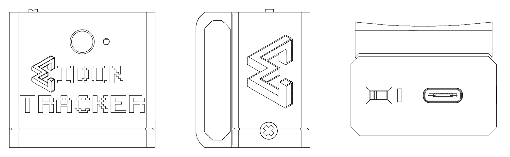

**Version 1.0**
**Date: November 2025**

---

## Table of Contents

1. [Executive Summary](#1-executive-summary)
2. [System Overview](#2-system-overview)
3. [Hardware Platform](#3-hardware-platform)
4. [Firmware & Embedded Software](#4-firmware--embedded-software)
5. [Data Collection & Processing Pipeline](#5-data-collection--processing-pipeline)
6. [Mathematical Framework](#6-mathematical-framework)
7. [Integration Ecosystem](#7-integration-ecosystem)
8. [Applications & Use Cases](#8-applications--use-cases)
9. [Technical Specifications](#9-technical-specifications)
10. [Conclusion](#10-conclusion)

---

## 1. Executive Summary

### The Embodied AI Data Challenge

The field of humanoid robotics stands at a critical inflection point. While Large Language Models (LLMs) have revolutionized AI through massive-scale training on web-scraped text data, embodied AI systems lack equivalent datasets. Current approaches to humanoid robot training rely on:

- **Laboratory teleoperation**: Expensive, controlled environments with fixed capture systems
- **Limited mobility**: Robots cannot learn tasks outside specialized facilities
- **Scale limitations**: Data collection is slow, costly, and geographically constrained
- **Missing human context**: Training data lacks the natural variability of real-world human movement

### The Eidon Solution

The **Eidon Tracker System** bridges this data gap by enabling **field-deployable, full-body motion capture** for creating Vision-Language-Action (VLA) training datasets. Our platform allows researchers to collect embodied AI training data anywhere humans perform tasks—from kitchens to construction sites to healthcare facilities.

**Key Value Propositions:**

- **Wearable precision tracking**: 7-device system captures full upper body kinematics with ±1-2° accuracy
- **High-speed data acquisition**: 48Hz IMU sampling with real-time quaternion streaming via BLE
- **Field-deployable design**: Battery-powered, wireless, robust 3D-printed enclosures with integrated mounting
- **Synchronized multimodal capture**: IMU orientation data timestamped with head-mounted camera video
- **Complete vertical integration**: Custom PCB, firmware, enclosure, and data processing pipeline
- **Open architecture**: Integration-ready for third-party VLA training pipelines and robotic platforms

### The "LLM Moment" for Humanoid Robotics

Just as LLMs achieved breakthrough performance through massive-scale diverse training data, humanoid robots require rich datasets of human manipulation tasks paired with visual context. Eidon Tracker makes this data economically feasible to collect at scale, enabling:

- **Diverse task libraries**: Collect thousands of task demonstrations across varied environments
- **Natural variability**: Capture how different humans approach the same task
- **Context-rich training**: Pair skeletal kinematics with egocentric video for multimodal learning
- **Rapid iteration**: Quickly create bespoke datasets for new domains (healthcare, manufacturing, domestic, etc.)

**Target Applications:**
- VLA model training for humanoid manipulation
- Teleoperation interfaces for remote robotics
- Biomechanics research and ergonomic analysis
- Motion capture for animation and VR/AR
- Physical therapy and rehabilitation monitoring

---

## 2. System Overview

### Architecture

The Eidon ecosystem consists of three integrated subsystems:

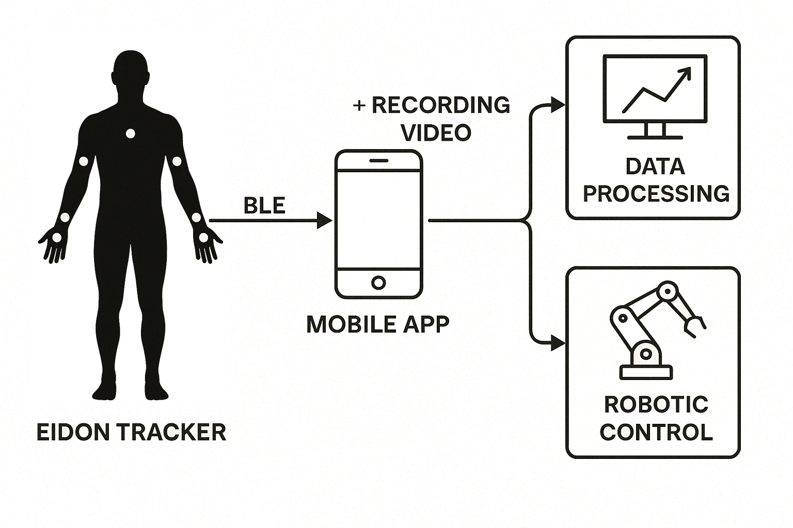

#### 2.1 Eidon Tracker Hardware

Seven wearable IMU devices providing real-time orientation tracking:

- **3 × Upper extremity pairs**: Left/right hand, forearm, upper arm
- **1 × Torso tracker**: Chest-mounted reference frame

Each device contains:
- Custom 2-layer PCB with ESP32-C6 microcontroller
- BNO085 9-DOF IMU with hardware sensor fusion
- LiPo battery with voltage monitoring
- Status LED indicators
- Injection-moldable 3D-printed enclosure with integrated mounting
- Multi-protocol wireless (BLE + ESP-NOW)

#### 2.2 Mobile Application Hub

Smartphone app serving as central data aggregator:

- **BLE connectivity**: Receives 48Hz quaternion streams from all 7 trackers
- **Video capture**: Records timestamped head-mounted POV video
- **Data synchronization**: Aligns IMU and video timestamps
- **Storage & export**: Packages datasets for offline processing

#### 2.3 Data Processing Pipeline (eidon-sim)

Real-time and post-processing kinematics engine:

- **Quaternion-to-Euler conversion**: Extract anatomical joint angles
- **Forward kinematics**: Build 3D skeletal representation from orientation data
- **Inverse kinematics**: Derive joint angles from chained vectors
- **Filtering & smoothing**: Temporal consistency and noise reduction
- **3D visualization**: Real-time debugging and validation interface

### Data Flow

```
┌─────────────────────────────────────────────────────────────────────┐
│  CAPTURE PHASE (In-Field)                                           │
├─────────────────────────────────────────────────────────────────────┤
│  Human performs task wearing 7 Eidon Trackers + head-mounted phone │
│                                                                      │
│  IMU (48Hz) ──┬──► BLE ──┬──► Mobile App ──► Raw Dataset           │
│               │          │                                          │
│               └─ Quat ──┘                                          │
│                                                                      │
│  Phone Camera ───────────► Timestamped Video ──► Synchronized      │
└─────────────────────────────────────────────────────────────────────┘

┌─────────────────────────────────────────────────────────────────────┐
│  PROCESSING PHASE (Post-Collection)                                 │
├─────────────────────────────────────────────────────────────────────┤
│  Raw Dataset ──► eidon-sim ──┬──► 7-DOF Joint Angles               │
│                               │                                      │
│                               ├──► 3D Skeletal Trajectory           │
│                               │                                      │
│                               └──► Aligned Video Frames             │
└─────────────────────────────────────────────────────────────────────┘

┌─────────────────────────────────────────────────────────────────────┐
│  TRAINING PHASE (VLA Pipeline)                                      │
├─────────────────────────────────────────────────────────────────────┤
│  Processed Dataset ──► VLA Training ──► Humanoid Control Policy    │
└─────────────────────────────────────────────────────────────────────┘
```

### Wearing Configuration

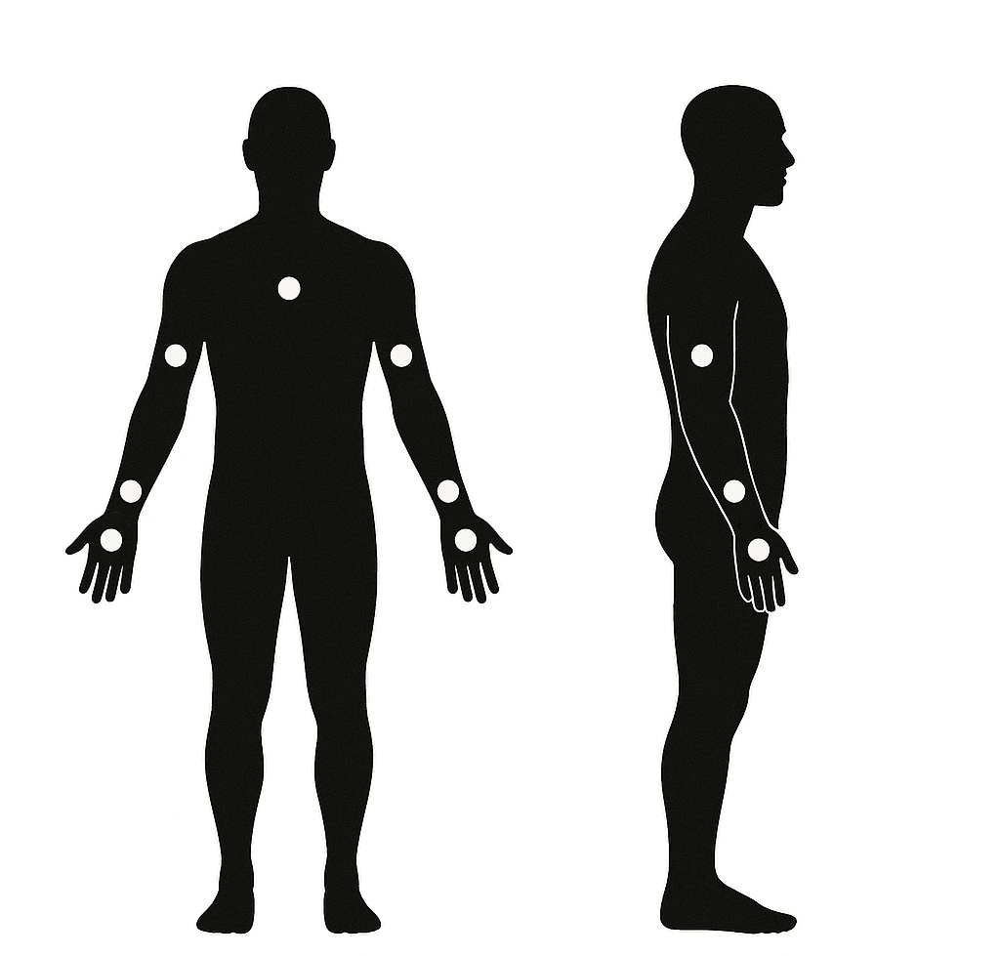

**Tracker Placement:**
- **Chest**: Center of sternum (reference frame)
- **Left/Right Upper Arm**: Lateral humerus (upper arm)
- **Left/Right Forearm**: Posterior radius (back of forearm)
- **Left/Right Hand**: Dorsal metacarpals (back of hand)

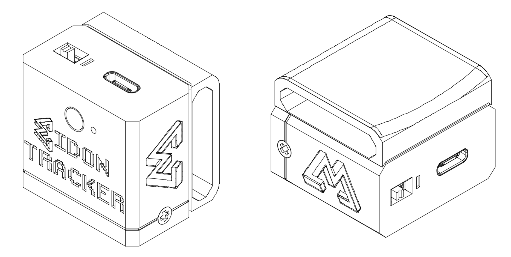

### Key System Specifications (Summary)

| Specification | Value |
|--------------|-------|
| **Number of tracking points** | 7 (chest, 2× upper arm, 2× forearm, 2× hand) |
| **IMU sampling rate** | 48 Hz |
| **Orientation accuracy** | ±1-2° RMS |
| **Wireless protocol** | BLE 5.0 (to mobile) + ESP-NOW (device-to-device) |
| **Battery life** | 8-12 hours continuous operation |
| **Latency** | <50ms end-to-end (IMU → mobile app) |
| **Form factor** | 45×30×15mm per tracker |
| **Weight** | ~25g per tracker with battery |
| **Cost per device** | $30.84 (current production) |
| **Complete 7-device system** | $278.87 (including harness and charging hub) |

---

## 3. Hardware Platform

The Eidon Tracker hardware represents a complete custom solution optimized for wearable motion capture. Each of the seven devices is identical, with role assignment configured via software.

### 3.1 Custom PCB Design

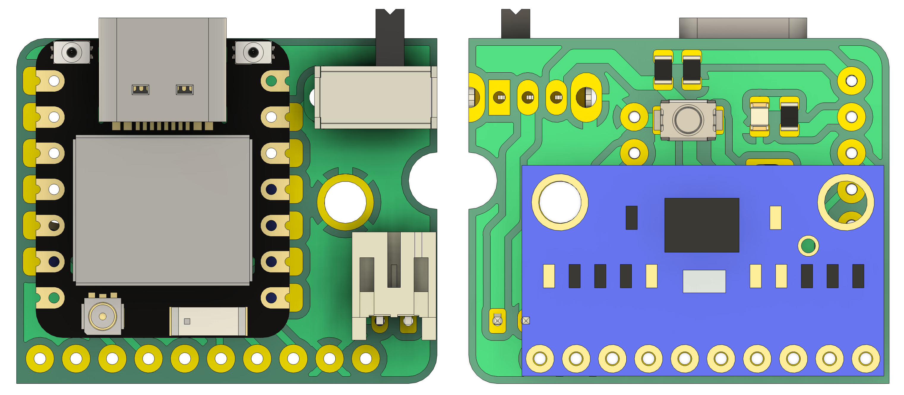

#### PCB Specifications

- **Board dimensions**: 25×20mm
- **Layer count**: 2-layer FR4
- **Thickness**: 1.6mm
- **Copper weight**: 1 oz (35µm)
- **Finish**: ENIG (Electroless Nickel Immersion Gold) for reliable soldering
- **Assembly**: PCBA-ready with pick-and-place files

#### Key Components

| Component | Part Number | Function | Key Specs |
|-----------|-------------|----------|-----------|
| **Microcontroller** | Seeed XIAO ESP32-C6 | Dual-mode wireless + processing | RISC-V 160MHz, 512KB SRAM, BLE 5.0, WiFi 6 |
| **IMU** | Bosch BNO085 | 9-DOF sensor fusion | ±2000°/s gyro, ±16g accel, hardware quaternion |
| **LED** | Kingbright APT2012YC | Status indicator | Yellow 0805 SMD, 20mcd @ 20mA |
| **Resistors** | Yageo RC0805 | Voltage divider + LED limiting | 220kΩ (×2), 1kΩ (×1), ±1% tolerance |
| **Button** | Alps SKRKAEE020 | User input | Tactile, 50mA rating, 160gf actuation |

#### Power Subsystem

**Battery Monitoring Circuit:**
- **Voltage divider**: 2× 220kΩ resistors create 2:1 ratio
- **ADC input**: ESP32-C6 GPIO0 (12-bit resolution)
- **Measurement range**: 0-8.4V (accommodates 2S LiPo configurations)
- **Accuracy**: ±50mV across battery discharge curve
- **Update rate**: 5-second intervals to conserve power

**Battery specification:**
- **Chemistry**: LiPo (Lithium Polymer)
- **Nominal voltage**: 3.7V
- **Capacity**: 150-300mAh (depending on size constraints)
- **Protection**: Built-in overcharge/discharge/short circuit protection
- **Connector**: JST PH 2.0mm

#### Communication Interfaces

**I2C Bus (IMU Interface):**
- **Speed**: 400 kHz (Fast Mode)
- **Pins**: GPIO19 (SCL), GPIO20 (SDA)
- **Pull-ups**: Internal ESP32 pull-ups enabled
- **Address**: 0x4B (configurable via GPIO18)

**Status Outputs:**
- **Main LED**: GPIO15 (connection state)
- **Aux LED**: GPIO1/A1 (activity indicator)
- **Drive current**: ~2mA per LED (optimized for visibility + battery life)

### 3.2 Mechanical Design

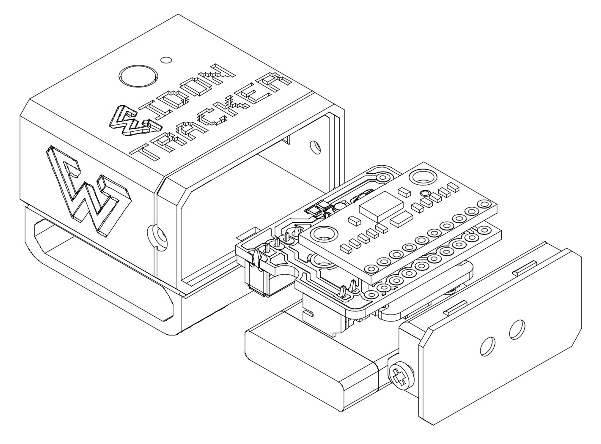

**Component Stack (top to bottom):**
- Top lid with button access hole
- Main enclosure body with PCB mounting posts
- PCB with battery underneath
- Integrated mounting strap channels
- Bottom face with logo/ventilation

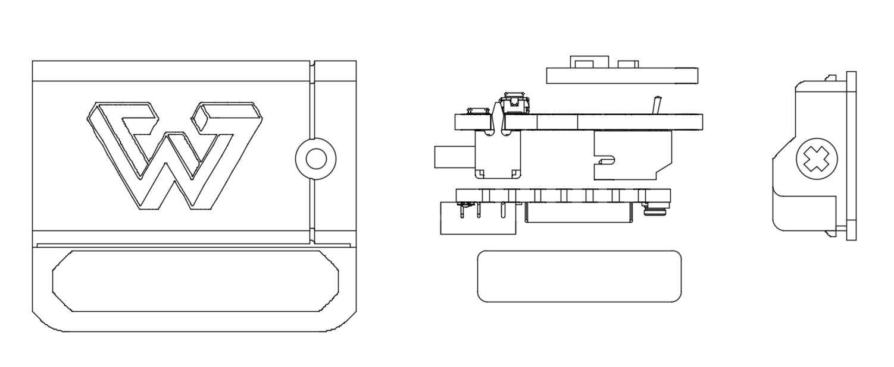

#### Enclosure Specifications

**Current Design**: Version 3b (eidon-tracker-v3b)

- **Overall dimensions**: 45mm (L) × 30mm (W) × 15mm (H)
- **Volume**: ~20 cm³
- **Material**: PLA or ABS (3D printed), injection-mold-ready geometry
- **Wall thickness**: 2.0mm (structural sections), 1.5mm (flexible clips)
- **Mounting**: Integrated strap channels for 20mm elastic bands
- **Sealing**: Friction-fit lid with overlapping lip (IP42 equivalent)

**Design Features:**
- **PCB mounting posts**: Four 2mm diameter posts with press-fit or screw retention
- **Battery cavity**: Optimized for 40×20×10mm LiPo cells
- **LED light pipes**: Translucent channels guide status LED to external face
- **Button actuator**: Sliding plunger transfers force to PCB-mounted switch
- **Cable routing**: Strain relief channel for charging cable (if applicable)
- **Labeling surfaces**: Recessed areas for role identification stickers

#### Mounting System

<div class="side-by-side">
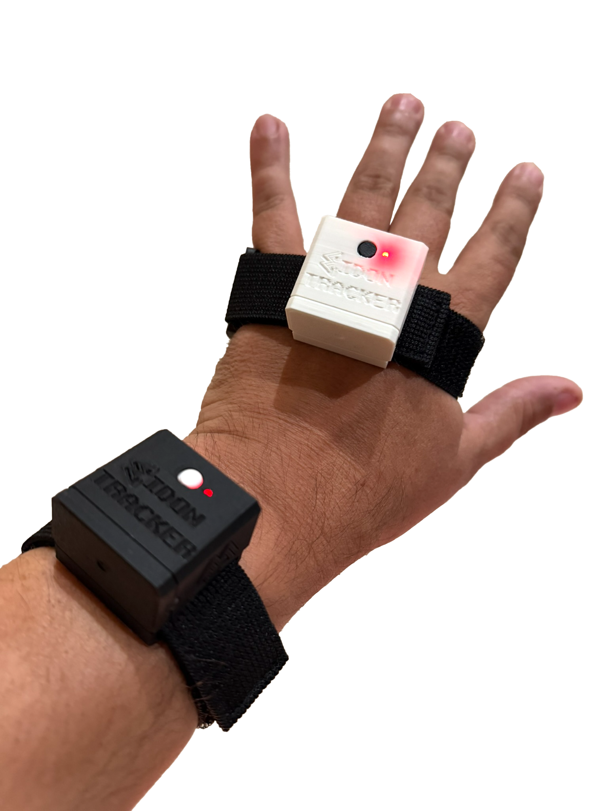
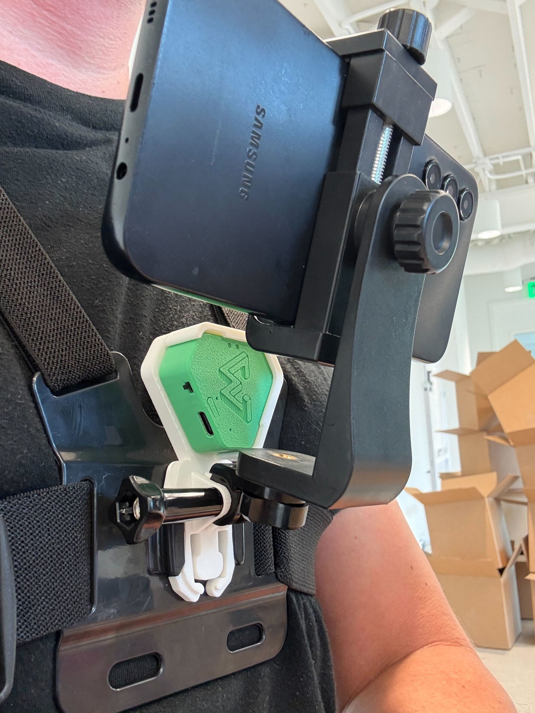
</div>

**Integrated Mounting System:**
- Strap channels are built directly into the enclosure body (no separate bracket required)
- 20mm elastic webbing threads through molded slots on sides of enclosure
- Allows for quick attachment/removal while maintaining secure fit
- Earlier design iterations used separate STL mounting brackets (deprecated in v3b)

**Strap specifications:**
- **Material**: Elastic webbing or neoprene
- **Width**: 20mm (standard) or 25mm (chest)
- **Closure**: Hook-and-loop (Velcro) or buckle
- **Tension**: Adjustable to accommodate varied body sizes

#### Manufacturing Considerations

**3D Printing Parameters:**
- **Layer height**: 0.2mm (standard quality)
- **Infill**: 20% gyroid or honeycomb
- **Supports**: Required for button plunger and undercuts
- **Print time**: ~1 hour per enclosure body, 20min per lid
- **Post-processing**: Minimal; light sanding on mating surfaces

**Injection Molding Readiness:**
- Draft angles: 2° on all vertical walls
- No undercuts (except designed-in snap features)
- Uniform wall thickness for even cooling
- Ejector pin locations planned in non-cosmetic areas

### 3.3 Bill of Materials (Complete Device)

| Category | Item | Quantity | Unit Cost | Notes |
|----------|------|----------|-----------|-------|
| **MCU** | Seeed XIAO ESP32-C6 | 1 | $5.20 | Includes castellated module |
| **IMU** | BNO085 breakout | 1 | $17.51 | Pre-calibrated module |
| **Battery** | LiPo (200-300mAh) | 1 | $4.59 | With protection circuit |
| **Power Switch** | Slide/toggle switch | 1 | $0.08 | SPDT switch |
| **Enclosure** | 3D-printed body + lid + button | 1 | $0.46 | PLA filament (amortized) |
| **Mounting** | Elastic strap with Velcro | 1 | $3.00 | 20mm elastic webbing |
| **Cable** | USB-C charging cable | 1 | $1.13 | Data + charging |
| **TOTAL** | | | **$30.84** | Per device |
| **7-device system** | | | **$215.88** | Trackers only |

**Complete 7-Device Kit (Ready to Use):**

| Item | Quantity | Unit Cost | Total |
|------|----------|-----------|-------|
| Eidon Tracker devices | 7 | $30.84 | $215.88 |
| Chest harness | 1 | $24.00 | $24.00 |
| USB charging hub | 1 | $35.99 | $35.99 |
| Extra straps (chest mount) | 1 | $3.00 | $3.00 |
| **TOTAL SYSTEM COST** | | | **$278.87** |

**Cost reduction at scale:**
- 100-unit production: ~$24/device ($168 for 7-device system)
- 1000-unit production: ~$18/device ($126 for 7-device system, IMU bulk pricing)

---

## 4. Firmware & Embedded Software

The Eidon Tracker firmware is a sophisticated real-time system managing sensor fusion, wireless communication, power optimization, and multi-device coordination.

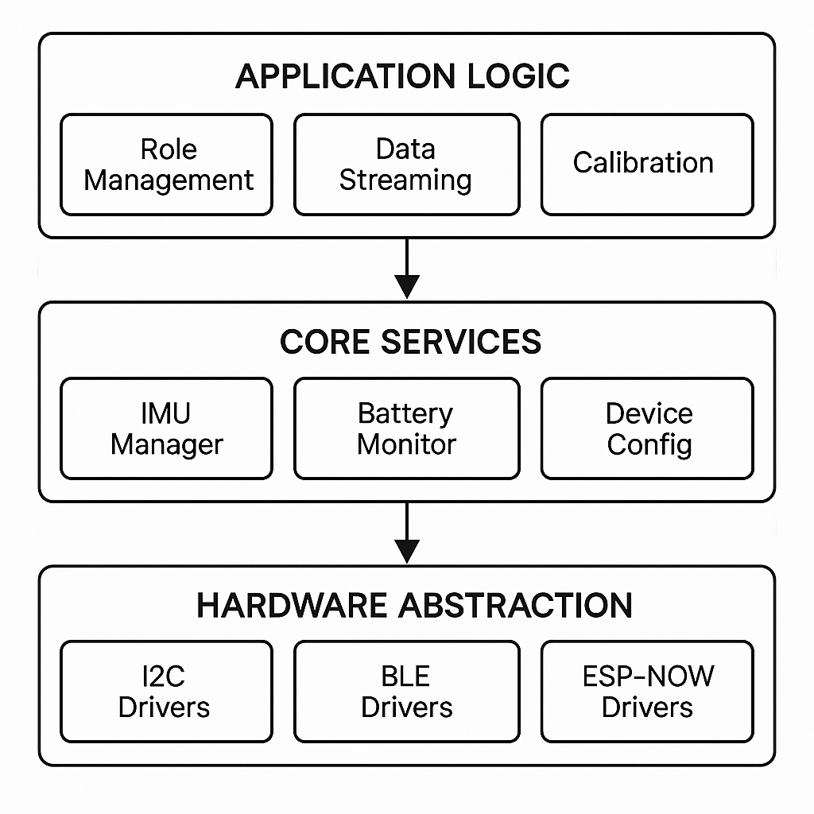

### 4.1 Development Environment

- **Framework**: Arduino (C/C++)
- **Build system**: PlatformIO
- **Target**: Espressif ESP32-C6 (RISC-V architecture)
- **Toolchain**: GCC 11.2+ for RISC-V
- **Flash size**: 4MB
- **OTA updates**: Supported via BLE (future feature)

**Key dependencies:**
- `Adafruit_BNO08x` v1.2.3+: IMU driver with quaternion output
- `NimBLE-Arduino` v2.3.1+: Lightweight BLE stack
- `ResponsiveAnalogRead` v1.2.1: Debounced ADC sampling

### 4.2 Core Firmware Capabilities

#### A. IMU Sensor Integration

**Sensor configuration** (from `firmware/lib/BNO085/BNO085.cpp`):

```cpp
// Initialize I2C communication at 400kHz
Wire.setPins(SDA_PIN, SCL_PIN);  // GPIO20, GPIO19
Wire.begin();
Wire.setClock(400000);

// Configure BNO085 for game rotation vector mode
bno08x.enableReport(SH2_GAME_ROTATION_VECTOR, 20833);  // 48Hz (20.83ms)
```

**Data acquisition loop** (48Hz):

```cpp
if (bno08x.getSensorEvent(&sensorValue)) {
  if (sensorValue.sensorId == SH2_GAME_ROTATION_VECTOR) {
    // Extract quaternion components
    float qw = sensorValue.un.gameRotationVector.real;
    float qx = sensorValue.un.gameRotationVector.i;
    float qy = sensorValue.un.gameRotationVector.j;
    float qz = sensorValue.un.gameRotationVector.k;

    // Apply 180° Z-axis rotation correction for mounting orientation
    currentQuaternion.w = qw;
    currentQuaternion.x = -qx;
    currentQuaternion.y = -qy;
    currentQuaternion.z = qz;
  }
}
```

**Why game rotation vector?**
- Fuses gyroscope + accelerometer (no magnetometer)
- Immune to magnetic interference (ferrous materials, electronics)
- Lower latency than full sensor fusion
- Ideal for relative tracking where absolute north is irrelevant

**Calibration mechanism:**
- **Trigger**: BLE command (0x01) or double-tap gesture detected by IMU
- **Action**: Send `MODE_SLEEP` → `MODE_ON` sequence to restart sensor fusion
- **LED feedback**: 300ms solid indicator during reset
- **Multi-device**: Hub role can broadcast calibration command to children via ESP-NOW

#### B. Dual-Radio Wireless Architecture

The firmware implements a unique **BLE + ESP-NOW** dual-protocol system for efficient multi-device coordination.

**BLE (Bluetooth Low Energy) - Primary Interface:**

Custom GATT service: `E1D00001-8B5A-3E5B-9E23-4F9B5C91BBDE`

| Characteristic UUID | Type | Function | Data Format |
|---------------------|------|----------|-------------|
| `E1D00002` | Read/Notify | Quaternion stream | 16 bytes: 4× float32 (w,x,y,z) |
| `E1D00003` | Read/Write | Calibration command | 1 byte: 0x01 = reset |
| `E1D00005` | Read | Device info | 14 bytes: ID, FW ver, battery%, role, MAC |
| `E1D00007` | Read/Write | Role configuration | 7 bytes: role (1) + hub MAC (6) |
| `E1D00008` | Read/Notify | Hand quaternion (hub aggregator) | 16 bytes |
| `E1D00009` | Read/Notify | Forearm quaternion (hub aggregator) | 16 bytes |

**BLE notification rate**: 24Hz (42ms intervals) to balance throughput and power

**Connection parameters:**
- Advertising interval: 100-200ms (discoverable mode)
- Connection interval: 7.5-20ms (low latency)
- Slave latency: 0 (no skipped events)
- Supervision timeout: 4000ms

**ESP-NOW - Child-to-Hub Communication:**

**When used:**
- Devices assigned forearm or hand roles
- Hub device (upper arm) aggregates data from hand + forearm
- Eliminates need for mobile app to manage 3× BLE connections per arm

**Protocol details:**
```cpp
// ESP-NOW packet structure (20 bytes)
struct ESPNowQuaternionPacket {
  uint8_t messageType;   // 0x01 = quaternion data, 0x02 = command
  uint8_t senderRole;    // ROLE_LEFT_HAND, ROLE_RIGHT_FOREARM, etc.
  uint8_t reserved[2];
  float qw, qx, qy, qz;  // 16 bytes
} __attribute__((packed));
```

**Transmission rate**: 48Hz (matches IMU sampling)
**Channel**: WiFi Channel 1 (2412 MHz)
**Range**: 20-50m line-of-sight
**Latency**: <5ms typical

**Power optimization:**
- Children enter "ESP-NOW only" mode after 60s of BLE inactivity
- Hub remains BLE-connected to mobile app
- Reduces overall system power consumption by ~40%

#### C. Device Role System

**Seven role types** (configured via BLE characteristic `E1D00007`):

```cpp
enum DeviceRole {
  ROLE_LEFT_HAND      = 0,
  ROLE_RIGHT_HAND     = 1,
  ROLE_LEFT_FOREARM   = 2,
  ROLE_RIGHT_FOREARM  = 3,
  ROLE_LEFT_HUB       = 4,  // Left upper arm (aggregator)
  ROLE_RIGHT_HUB      = 5,  // Right upper arm (aggregator)
  ROLE_CHEST          = 6,
  ROLE_UNKNOWN        = 255
};
```

**Role assignment workflow:**
1. Devices boot in `ROLE_UNKNOWN` (read from persistent NVS storage)
2. Mobile app scans for nearby trackers
3. User assigns roles via app UI (e.g., "This is my left hand")
4. App writes role + hub MAC address to characteristic `E1D00007`
5. Device saves to NVS, reboots with new configuration
6. Future power-ons remember role assignment

**Hub role behavior:**
- Advertises BLE service with hand/forearm characteristics (`E1D00008`, `E1D00009`)
- Listens for ESP-NOW packets from configured children
- Aggregates: Hub's own IMU (upper arm) + hand + forearm quaternions
- Notifies mobile app with all three data streams at 24Hz
- Forwards calibration commands to children

**Child role behavior:**
- Connects to hub's ESP-NOW address (stored during role assignment)
- Sends local IMU quaternions via ESP-NOW at 48Hz
- Timeouts BLE after 60s to save power
- Re-enables BLE if ESP-NOW connection lost (failsafe)

#### D. Power Management

**Battery monitoring** (`firmware/src/main.cpp`):

```cpp
#define BAT_PIN GPIO0
#define BAT_R1 220000  // Upper resistor (Ω)
#define BAT_R2 220000  // Lower resistor (Ω)
#define BAT_MAX_V 4.2  // Fully charged LiPo
#define BAT_MIN_V 3.0  // Safe discharge limit

float readBatteryVoltage() {
  int adcValue = analogRead(BAT_PIN);  // 12-bit: 0-4095
  float voltage = (adcValue / 4095.0) * 3.3 * 2.0;  // Voltage divider correction
  return voltage;
}

uint8_t calculateBatteryPercent(float voltage) {
  if (voltage >= BAT_MAX_V) return 100;
  if (voltage <= BAT_MIN_V) return 0;
  return (uint8_t)((voltage - BAT_MIN_V) / (BAT_MAX_V - BAT_MIN_V) * 100);
}
```

**Update interval**: Every 5 seconds (balances accuracy and ADC power consumption)

**Current consumption estimates** (from `docs/HARDWARE_OVERVIEW.md`):
- **Active mode** (BLE connected + IMU sampling): ~15mA average
- **ESP-NOW only mode** (BLE off, hub children): ~10mA average
- **Deep sleep** (future): <10µA

**Battery life calculation** (200mAh cell):
- Active mode: 200mAh / 15mA = **13.3 hours**
- ESP-NOW mode: 200mAh / 10mA = **20 hours**
- Mixed usage (40% active, 60% ESP-NOW): **~16 hours**

#### E. LED Status Indicators

**Main LED (GPIO15)** - Connection state:
- **Blinking (500ms on/off)**: Advertising, not connected
- **Rapid toggle (100ms)**: Connected to mobile app
- **Solid 300ms**: IMU calibration in progress
- **Off**: Deep sleep or error

**Auxiliary LED (GPIO1)** - Secondary indicator:
- **Blinking**: Advertising
- **Solid**: Connected

### 4.3 Firmware Performance Metrics

| Metric | Value | Notes |
|--------|-------|-------|
| **IMU sampling rate** | 48 Hz | Hardware sensor fusion output |
| **BLE notification rate** | 24 Hz | Sufficient for smooth visualization |
| **ESP-NOW transmission** | 48 Hz | Child → hub, raw IMU rate |
| **End-to-end latency** | <50ms | IMU event → mobile app receipt |
| **Packet loss** | <0.1% | BLE in good signal conditions |
| **CPU utilization** | ~40% | Room for additional features |
| **RAM usage** | ~80KB / 256KB | 31% utilization |
| **Flash usage** | ~452KB / 4MB | 11% utilization |

### 4.4 Firmware File Structure

```
firmware/
├── src/
│   ├── main.cpp                    # Entry point, core loop (1,191 lines)
│   ├── DeviceConfig.h/cpp          # Persistent NVS storage for role
│   ├── BLE_Services/
│   │   ├── BLE_Callbacks.h/cpp    # Connection/disconnection handlers
│   │   └── BLE_Polling_Service.h/cpp  # Periodic characteristic reads
│   └── Role_Services/
│       ├── HubClient_Service.h/cpp    # ESP-NOW receiver (hub role)
│       ├── RoleConfig_Service.h/cpp   # Role assignment handler
│       └── Hub_Structures.h           # Shared data structures
├── lib/
│   ├── BNO085/                     # IMU driver wrapper
│   └── ColorManager/               # LED color control utilities
├── platformio.ini                  # Build configuration
└── ext_nimble_config.h             # NimBLE stack customization
```

**Key code locations:**
- Quaternion correction: `firmware/src/main.cpp:428-432`
- Battery monitoring: `firmware/src/main.cpp:156-178`
- Role configuration: `firmware/src/Role_Services/RoleConfig_Service.cpp`
- Hub aggregation: `firmware/src/Role_Services/HubClient_Service.cpp`

---

## 5. Data Collection & Processing Pipeline

The Eidon system transforms raw IMU quaternions into actionable skeletal kinematics through a sophisticated processing pipeline implemented in the **eidon-sim** repository.

<!-- **IMAGE PLACEHOLDER: Data Pipeline Flowchart**
*Description: Flowchart showing:*
1. *Raw quaternions (7 devices, 48Hz) → Mobile app aggregation*
2. *Timestamped video frames (30-60fps) → Mobile app storage*
3. *Synchronized dataset → eidon-sim processing*
4. *Output: 7-DOF joint angles, 3D skeletal trajectory, aligned video* -->

### 5.1 Mobile Application Hub

**Platform**: iOS/Android (Flutter framework)

**Core functions:**
1. **Multi-device BLE management**
   - Scans for Eidon Tracker devices
   - Connects to 3-5 devices simultaneously (chest + left/right hubs + optional extras)
   - Subscribes to quaternion notification characteristics
   - Handles reconnection logic for dropped connections

2. **Data aggregation**
   - Receives quaternion streams from 7 total IMUs (via direct connection or hub aggregation)
   - Timestamps each quaternion packet with system monotonic clock
   - Buffers data in memory (circular buffer, 10-second capacity)

3. **Video capture**
   - Records egocentric video at 30-60fps (device-dependent)
   - Embeds timestamps in video metadata track
   - Optional: Audio recording for task annotation

4. **Synchronization**
   - Aligns IMU timestamps with video frame timestamps
   - Accounts for BLE latency variability (~5-50ms jitter)
   - Uses device clock synchronization protocol

5. **Dataset export**
   - Packages IMU data (binary or JSON), video file, metadata into single archive
   - Optional cloud upload (future feature)


### 5.2 Quaternion Data Format

**Raw quaternion packet** (from BLE characteristic):

```
Byte offset | Field      | Type      | Description
------------|------------|-----------|----------------------------
0-3         | qw         | float32   | Quaternion scalar (real) component
4-7         | qx         | float32   | Quaternion i (x) vector component
8-11        | qy         | float32   | Quaternion j (y) vector component
12-15       | qz         | float32   | Quaternion k (z) vector component
```

**Quaternion properties:**
- Normalized: w² + x² + y² + z² = 1.0 (enforced by BNO085 firmware)
- Right-handed coordinate system
- Mounting correction pre-applied (180° Z-rotation)
- Represents rotation from sensor local frame → global reference frame

**Device info packet** (characteristic `E1D00005`):

```
Byte offset | Field         | Type    | Description
------------|---------------|---------|----------------------------
0           | device_id     | uint8   | Unique ID (0-255)
1           | fw_major      | uint8   | Firmware version major (currently 1)
2           | fw_minor      | uint8   | Firmware version minor (currently 2)
3           | battery_pct   | uint8   | Battery percentage (0-100)
4           | device_role   | uint8   | DeviceRole enum value
5-10        | mac_address   | uint8×6 | Bluetooth MAC address
```

### 5.3 eidon-sim Processing Engine

**Repository**: `~/eidon/eidon-sim`
**Framework**: TypeScript + Three.js
**Execution**: Web application (browser-based) or Node.js CLI

<!-- **IMAGE PLACEHOLDER: eidon-sim Screenshot**
*Description: Screenshot showing:*
- *3D viewport with skeletal avatar performing task*
- *Left sidebar: Device connection status*
- *Right sidebar: Real-time joint angle readouts (7-DOF per arm)*
- *Bottom: Timeline scrubber with video playback* -->

#### Core Processing Modules

**A. Quaternion Decoder** (`src/core/reportParsers.ts`)

Converts raw binary quaternion data to usable format:

```typescript
function decodeQuaternion(buffer: ArrayBuffer, offset: number): quat {
  const dv = new DataView(buffer);
  const qw = dv.getFloat32(offset + 0, true);  // Little-endian
  const qx = dv.getFloat32(offset + 4, true);
  const qy = dv.getFloat32(offset + 8, true);
  const qz = dv.getFloat32(offset + 12, true);
  return [qx, qy, qz, qw];  // gl-matrix format: [x, y, z, w]
}
```

**Coordinate frame transformation** (sensor → Three.js world):

```typescript
// Sensor coordinate frame: X=forward, Y=right, Z=up
// Three.js world frame: X=right, Y=up, Z=backward
const upZ = vec3.transformQuat(vec3.create(), [0, 0, 1], quaternion);
const up = [upZ[0], upZ[2], -upZ[1]];  // Swap Y↔Z, negate new Y

const fwdZ = vec3.transformQuat(vec3.create(), [0, 1, 0], quaternion);
const fwd = [fwdZ[0], fwdZ[2], -fwdZ[1]];
```

**B. Seven-Degree-of-Freedom Arm Solver** (`src/core/ArmSolver.ts`)

The ArmSolver class is the heart of the kinematics pipeline. It takes 3 quaternions (upper arm, forearm, hand) and outputs 7 anatomical joint angles:

**Shoulder joint (3-DOF):**
1. **Yaw** (internal/external rotation)
2. **Pitch** (flexion/extension)
3. **Roll** (abduction/adduction)

**Elbow joint (1-DOF):**
4. **Flex** (flexion/extension angle)

**Forearm (1-DOF):**
5. **Roll** (pronation/supination)

**Wrist joint (2-DOF):**
6. **Yaw** (ulnar/radial deviation)
7. **Pitch** (flexion/extension)

**Algorithmic approach** (detailed in Section 6: Mathematical Framework)

**C. 3D Skeletal Visualization** (`src/ui/scene/`)

**Two rendering modes:**

1. **Vector Arm Mode** (`vectorArm.ts`):
   - Represents limbs as directional arrows
   - Useful for debugging quaternion orientation
   - Shows forward/up vectors for each segment

2. **Skeletal Rig Mode** (`skeletalRig.ts`):
   - Applies quaternions/angles to GLTF humanoid model
   - Realistic avatar for validation
   - Exports animation data (future: GLTF/FBX export)

<!-- **IMAGE PLACEHOLDER: Side-by-Side Rendering Modes**
*Description: Split image showing:*
- *Left: Vector arm mode (colored arrows showing humerus, radius, hand segments)*
- *Right: Skeletal rig mode (textured humanoid model with same pose)* -->

**D. Temporal Filtering**

To reduce high-frequency noise from IMU drift and vibration:

**Angle unwrapping** (prevents discontinuities at ±180°):
```typescript
function unwrapAngle(current: number, previous: number): number {
  const diff = current - previous;
  if (diff > 180) return current - 360;
  if (diff < -180) return current + 360;
  return current;
}
```

**Exponential moving average** (EMA smoothing):
```typescript
const ALPHA = 0.15;  // Smoothing factor (0=none, 1=no smoothing)
const filtered = previous + ALPHA * (current - previous);
```

**Configurable parameters:**
- `ALPHA`: Adjustable via UI slider (0.05 for slow motion, 0.3 for fast motion)
- Can disable smoothing for raw data export

### 5.4 Output Data Products

The eidon-sim pipeline generates multiple output formats:

**1. Joint Angle Time Series (CSV)**

```csv
timestamp_ms, shoulder_yaw_L, shoulder_pitch_L, shoulder_roll_L, elbow_flex_L, forearm_roll_L, wrist_yaw_L, wrist_pitch_L, [right arm angles...], chest_yaw, chest_pitch, chest_roll
0, 12.4, -23.1, 5.7, 87.3, -15.2, 8.9, -12.1, ...
21, 12.6, -23.5, 5.9, 88.1, -14.8, 9.2, -11.9, ...
...
```

**2. 3D Skeletal Positions (JSON)**

```json
{
  "timestamp_ms": 0,
  "left_arm": {
    "shoulder": [0.3, 1.4, 0.0],
    "elbow": [0.45, 1.15, 0.12],
    "wrist": [0.52, 0.91, 0.08],
    "fingertip": [0.58, 0.82, 0.05]
  },
  "right_arm": { ... },
  "chest": [0.0, 1.3, 0.0]
}
```

**3. Video with Overlay (MP4)**

Synchronized video with:
- On-screen joint angle readouts
- Skeleton overlay (optional)
- Timestamp and session metadata

**4. VLA Training Format**

**Proposed structure** (compatible with common VLA frameworks):

```json
{
  "task": "pick_and_place_cup",
  "episode_id": "ep_00123",
  "frames": [
    {
      "timestamp": 0.000,
      "observation": {
        "image": "frame_0000.jpg",
        "proprio": {
          "left_arm_7dof": [12.4, -23.1, 5.7, 87.3, -15.2, 8.9, -12.1],
          "right_arm_7dof": [...]
        }
      },
      "action": {
        "left_arm_delta": [0.1, 0.0, -0.2, 1.5, 0.0, 0.0, 0.0],
        "right_arm_delta": [...]
      }
    },
    ...
  ]
}
```

**Action labeling:**
- Manual annotation via UI timeline
- Future: GPT-4V automatic segmentation from video

---

## 6. Mathematical Framework

This section details the mathematical transformations that convert raw IMU quaternions into anatomically meaningful joint angles.

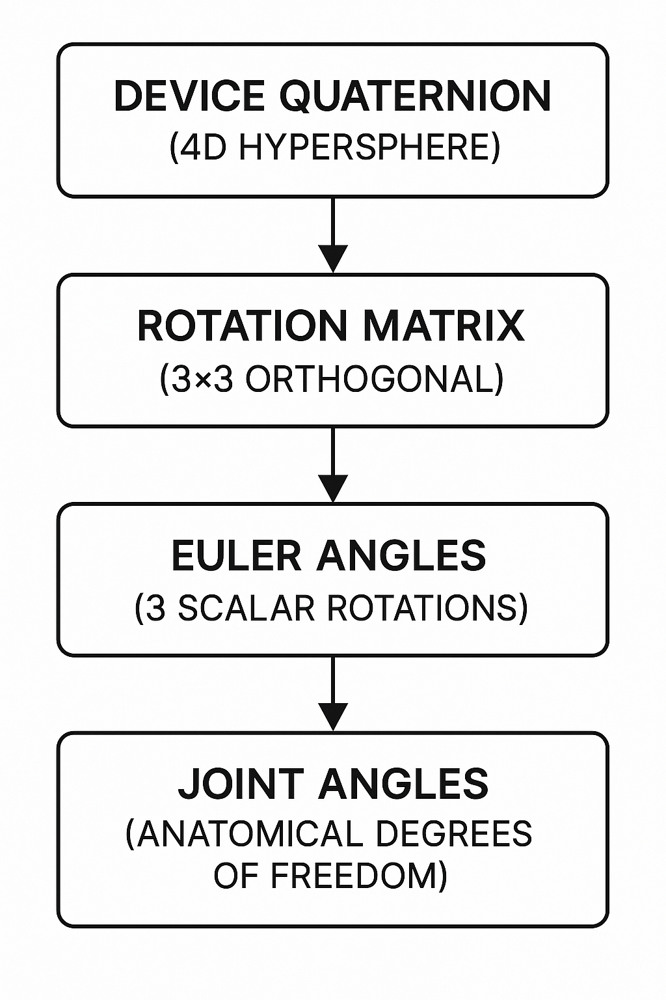

### 6.1 Quaternion Fundamentals

**Definition:**

A quaternion **q** is a 4-dimensional number representing 3D rotation:

```
q = w + xi + yj + zk
```

where `i² = j² = k² = ijk = -1`

**Vector form**: `q = [x, y, z, w]` (or `[qx, qy, qz, qw]`)

**Properties:**
- **Unit quaternion**: ‖q‖ = √(w² + x² + y² + z²) = 1
- **Identity rotation**: q = [0, 0, 0, 1] (no rotation)
- **Inverse**: q⁻¹ = [−x, −y, −z, w] / ‖q‖² (for unit quaternions: q⁻¹ = q*)
- **Composition**: Rotate by q₁ then q₂: q_combined = q₂ ⊗ q₁ (note: non-commutative)

**Quaternion multiplication** (Hamilton product):

```
q₁ ⊗ q₂ = [
  w₁w₂ − x₁x₂ − y₁y₂ − z₁z₂,
  w₁x₂ + x₁w₂ + y₁z₂ − z₁y₂,
  w₁y₂ − x₁z₂ + y₁w₂ + z₁x₂,
  w₁z₂ + x₁y₂ − y₁x₂ + z₁w₂
]
```

**Rotating a vector** v by quaternion q:

```
v' = q ⊗ [0, v] ⊗ q⁻¹
```

Implemented efficiently as:
```typescript
vec3.transformQuat(out, v, q)
```

### 6.2 Quaternion to Rotation Matrix

The quaternion `q = [x, y, z, w]` converts to a 3×3 rotation matrix:

```
     ⎡ 1−2(y²+z²)   2(xy−wz)     2(xz+wy)   ⎤
R =  ⎢ 2(xy+wz)     1−2(x²+z²)   2(yz−wx)   ⎥
     ⎣ 2(xz−wy)     2(yz+wx)     1−2(x²+y²) ⎦
```

**Code implementation** (`src/core/mathUtils.ts`):

```typescript
export function quatToMat3(q: quat): mat3 {
  const m = mat3.create();
  mat3.fromQuat(m, q);
  return m;
}
```

**Why convert to matrix?**
- Euler angle extraction requires matrix elements
- Some angle calculations (gimbal-lock analysis) easier in matrix form
- Compatibility with other graphics libraries

### 6.3 Euler Angle Extraction

Euler angles represent 3D rotation as three sequential rotations about fixed axes. The **order matters** due to non-commutativity.

<!-- **IMAGE PLACEHOLDER: Euler Angle Convention Diagram**
*Description: 3D coordinate system showing Z-Y-X rotation sequence:*
1. *First rotate α about Z-axis (yaw)*
2. *Then rotate β about new Y-axis (pitch)*
3. *Finally rotate γ about new X-axis (roll)*
*Show intermediate frames after each rotation* -->

#### A. Z-Y-X Euler Angles (Shoulder)

Used for shoulder joint angles (ISB biomechanics convention).

**Mathematical derivation:**

Given rotation matrix R from quaternion, extract angles:

```
R = Rz(α) · Ry(β) · Rx(γ)

     ⎡ cos(α)cos(β)   cos(α)sin(β)sin(γ)−sin(α)cos(γ)   cos(α)sin(β)cos(γ)+sin(α)sin(γ) ⎤
  =  ⎢ sin(α)cos(β)   sin(α)sin(β)sin(γ)+cos(α)cos(γ)   sin(α)sin(β)cos(γ)−cos(α)sin(γ) ⎥
     ⎣ −sin(β)        cos(β)sin(γ)                       cos(β)cos(γ)                     ⎦
```

**Solving for Euler angles:**

```
α (yaw)   = atan2(−R[1][0], R[0][0])
β (pitch) = asin(R[2][0])
γ (roll)  = atan2(−R[2][1], R[2][2])
```

**Code implementation** (`src/core/mathUtils.ts:9-23`):

```typescript
export function eulerZYX(q: quat): [number, number, number] {
  const m = mat3.fromQuat(mat3.create(), q);

  // Extract matrix elements (column-major indexing)
  const m00 = m[0], m10 = m[1], m20 = m[2];
  const m21 = m[5], m22 = m[8];

  const yaw   = Math.atan2(-m10, m00);   // Z rotation
  const pitch = Math.asin(m20);           // Y rotation
  const roll  = Math.atan2(-m21, m22);   // X rotation

  return [yaw, pitch, roll];  // Radians
}
```

**Singularity handling:**
When pitch ≈ ±90°, yaw and roll become coupled (gimbal lock). Solution:
- Clamp `asin` input to [-1, 1] to prevent NaN
- Accept reduced accuracy near singularity (rare in human arm motion)

#### B. X-Y-Z Euler Angles (Wrist)

Alternative convention for wrist joint (avoids gimbal lock in different configuration).

**Direct quaternion formula** (avoids matrix conversion):

```typescript
export function eulerXYZ(q: quat): [number, number, number] {
  const [x, y, z, w] = q;

  const yaw = Math.atan2(2.0 * (w * z + x * y),
                        1.0 - 2.0 * (y * y + z * z));

  const pitch = Math.asin(Math.max(-1, Math.min(1, 2.0 * (w * y - z * x))));

  const roll = Math.atan2(2.0 * (w * x + y * z),
                         1.0 - 2.0 * (x * x + y * y));

  return [yaw, roll, pitch];  // Note: pitch/roll swapped to match convention
}
```

### 6.4 Vector-Based Angle Calculations

For single-axis joints (elbow flexion), vector dot product is simpler and more robust than Euler angles.

#### Elbow Flexion Angle

<!-- **IMAGE PLACEHOLDER: Elbow Angle Diagram**
*Description: Side view of arm showing:*
- *Upper arm forward vector (blue arrow from shoulder)*
- *Forearm forward vector (red arrow from elbow)*
- *Angle θ between vectors*
- *Labels: 0° = straight, 180° = fully bent* -->

**Mathematical formula:**

Given unit vectors **u** (upper arm forward) and **l** (forearm forward):

```
θ = arccos(u · l)
```

where `u · l = ux·lx + uy·ly + uz·lz` (dot product)

**Code implementation** (`src/core/mathUtils.ts:74-79`):

```typescript
export function elbowFlexDeg(fwdUpper: vec3, fwdLower: vec3): number {
  const u = vec3.normalize(vec3.create(), fwdUpper);
  const l = vec3.normalize(vec3.create(), fwdLower);
  const cosAngle = vec3.dot(u, l);

  // Clamp to [-1, 1] to prevent numerical errors in acos
  const clampedCos = Math.max(-1, Math.min(1, cosAngle));

  return Math.acos(clampedCos) * 180 / Math.PI;
}
```

**Why this works:**
- Independent of shoulder orientation (only measures elbow bend)
- No gimbal lock (single axis)
- Output range: [0°, 180°] (0° = straight arm, 180° = maximally bent)

**Anatomical interpretation:**
- 0° = Full extension (arm straight)
- 90° = Right angle
- 145° = Typical maximum flexion

### 6.5 Forearm Roll (Pronation/Supination)

**Challenge:**
Measuring twist of forearm about its long axis while elbow bends.

**Naive approach fails:**
Simply comparing quaternions gives coupled elbow+roll motion.

**Robust solution:**
Project "up" vectors onto plane perpendicular to forearm forward direction.

<!-- **IMAGE PLACEHOLDER: Forearm Roll Geometry**
*Description: 3D diagram showing:*
- *Forearm cylinder with forward axis (green)*
- *Upper arm "up" vector (blue) and its projection (dashed blue) onto perpendicular plane*
- *Forearm "up" vector (red) and its projection (dashed red) onto same plane*
- *Angle θ between projections* -->

**Mathematical steps:**

1. **Extract up/forward vectors** from upper arm and forearm quaternions
2. **Project upper arm up vector** onto plane perpendicular to forearm forward:
   ```
   up_upper_proj = up_upper − (up_upper · fwd_forearm) · fwd_forearm
   ```
3. **Project forearm up vector** onto same plane:
   ```
   up_forearm_proj = up_forearm − (up_forearm · fwd_forearm) · fwd_forearm
   ```
4. **Calculate angle** between projections:
   ```
   θ = arccos(up_upper_proj · up_forearm_proj / (‖up_upper_proj‖ · ‖up_forearm_proj‖))
   ```
5. **Determine sign** using cross product:
   ```
   sign = (up_upper_proj × up_forearm_proj) · fwd_forearm ≥ 0 ? −1 : 1
   ```

**Code implementation** (`src/core/ArmSolver.ts:114-158`):

```typescript
// Get up vectors from quaternions
const upperUp = vec3.transformQuat(vec3.create(), [0, 0, 1], Q_UpperArm);
const lowerUp = vec3.transformQuat(vec3.create(), [0, 0, 1], Q_Forearm);
const lowerFwd = vec3.transformQuat(vec3.create(), [0, 1, 0], Q_Forearm);

// Project onto plane perpendicular to forearm forward
const upperDot = vec3.dot(upperUp, lowerFwd);
const lowerDot = vec3.dot(lowerUp, lowerFwd);

const upperUpProj = vec3.create();
const lowerUpProj = vec3.create();
vec3.scaleAndAdd(upperUpProj, upperUp, lowerFwd, -upperDot);
vec3.scaleAndAdd(lowerUpProj, lowerUp, lowerFwd, -lowerDot);

vec3.normalize(upperUpProj, upperUpProj);
vec3.normalize(lowerUpProj, lowerUpProj);

// Calculate angle
const cosAngle = vec3.dot(upperUpProj, lowerUpProj);
const angle = Math.acos(Math.max(-1, Math.min(1, cosAngle)));

// Determine sign
const cross = vec3.cross(vec3.create(), upperUpProj, lowerUpProj);
const sign = vec3.dot(cross, lowerFwd) >= 0 ? -1 : 1;

const forearmRollDeg = sign * angle * 180 / Math.PI;
```

**Anatomical interpretation:**
- **Negative angles**: Pronation (palm down)
- **Positive angles**: Supination (palm up)
- **Range**: Approximately −90° to +90°

### 6.6 Relative Quaternion Method (Wrist Angles)

Wrist angles should be measured **relative to forearm**, not absolute. This cancels accumulated drift from shoulder/elbow.

**Mathematical approach:**

Given forearm quaternion **q_forearm** and hand quaternion **q_hand**:

1. **Calculate relative rotation:**
   ```
   q_wrist = q_forearm⁻¹ ⊗ q_hand
   ```

2. **Extract Euler angles** from `q_wrist` using Z-Y-X convention

**Code implementation** (`src/core/ArmSolver.ts:162-184`):

```typescript
// Calculate relative quaternion: hand in forearm's reference frame
const Q_Wrist = quat.multiply(
  quat.create(),
  quat.invert(quat.create(), Q_Forearm),
  Q_Hand
);
quat.normalize(Q_Wrist, Q_Wrist);

// Extract wrist Euler angles
const [wristYaw, wristRoll, wristPitch] = eulerZYX(Q_Wrist);

// Convert radians to degrees
const wristYawDeg = wristYaw * 180 / Math.PI;
const wristPitchDeg = wristPitch * 180 / Math.PI;
```

**Why relative quaternions?**
- **Drift cancellation**: Any IMU drift common to forearm and hand cancels out
- **Anatomical correctness**: Wrist motion is inherently relative to forearm orientation
- **Gimbal lock avoidance**: Wrist rarely reaches singularity in forearm-relative frame

### 6.7 Complete Seven-Angle Solver

**Summary of derivation pipeline for one arm:**

```
Inputs: Q_UpperArm, Q_Forearm, Q_Hand (3 quaternions)

1. Shoulder angles (3-DOF):
   [yaw, pitch, roll] = eulerZYX(Q_UpperArm) * 180/π

2. Elbow flex (1-DOF):
   fwd_upper = rotate([0,1,0], Q_UpperArm)
   fwd_forearm = rotate([0,1,0], Q_Forearm)
   flex = elbowFlexDeg(fwd_upper, fwd_forearm)

3. Forearm roll (1-DOF):
   up_upper = rotate([0,0,1], Q_UpperArm)
   up_forearm = rotate([0,0,1], Q_Forearm)
   roll = forearmRollProjectionMethod(up_upper, up_forearm, fwd_forearm)

4. Wrist angles (2-DOF):
   Q_wrist = Q_Forearm⁻¹ ⊗ Q_Hand
   [yaw, pitch] = eulerZYX(Q_wrist)[0,2] * 180/π

Outputs: [sh_yaw, sh_pitch, sh_roll, el_flex, fr_roll, wr_yaw, wr_pitch]
```

<!-- **IMAGE PLACEHOLDER: 7-DOF Arm Diagram**
*Description: Annotated arm illustration showing all 7 angles with arrows:*
- *Shoulder: 3 curved arrows for yaw/pitch/roll*
- *Elbow: 1 curved arrow for flexion*
- *Forearm: 1 straight arrow for roll axis*
- *Wrist: 2 curved arrows for yaw/pitch* -->

### 6.8 Forward Kinematics (Vector Chaining)

Once joint angles are known, we can reconstruct 3D joint positions using **forward kinematics**.

**Chain structure:**

```
Shoulder (fixed) → [Upper Arm] → Elbow → [Forearm] → Wrist → [Hand] → Fingertips
```

**Position calculation:**

```
P_shoulder = [±0.3, 1.4, 0.0]  (left/right offset from chest)

P_elbow = P_shoulder + L_humerus · fwd_upper

P_wrist = P_elbow + L_radius · fwd_forearm

P_fingertips = P_wrist + L_hand · fwd_hand
```

**Segment lengths** (configurable via UI):
- `L_humerus` = 0.30m (default)
- `L_radius` = 0.26m (default)
- `L_hand` = 0.10m (default)

**Code implementation** (`src/ui/scene/vectorArm.ts:144-154`):

```typescript
const shoulder: vec3 = this.side === 'left' ? [-0.3, 1.4, 0] : [0.3, 1.4, 0];

const elbowPos = vec3.scaleAndAdd(
  vec3.create(),
  shoulder,
  upperArmForward,
  HUM_LEN()
);

const wristPos = vec3.scaleAndAdd(
  vec3.create(),
  elbowPos,
  forearmForward,
  RAD_LEN()
);

const fingertipPos = vec3.scaleAndAdd(
  vec3.create(),
  wristPos,
  handForward,
  HAND_LEN()
);
```

**Visualization:**
- Render cylinders/lines between joint positions
- Color-code segments (blue = upper arm, green = forearm, yellow = hand)

---

## 7. Integration Ecosystem

The Eidon Tracker is designed as an **open platform** for embodied AI research. This section describes integration points with external systems.

<!-- **IMAGE PLACEHOLDER: Integration Ecosystem Diagram**
*Description: Hub-and-spoke diagram showing Eidon system (center) connecting to:*
- *VLA training frameworks (OpenVLA, Octo, RT-1)*
- *Robotic platforms (unitree, figure, 1x)*
- *Simulation environments (Isaac Sim, MuJoCo)*
- *Data annotation tools (CVAT, Label Studio)*
- *Cloud storage (S3, GCS)* -->

### 7.1 VLA Training Pipeline Integration

**Common VLA frameworks:**
- **OpenVLA**: Open-source vision-language-action model
- **Octo**: General-purpose robot policy trained on diverse datasets
- **RT-1/RT-2**: Google's Robotics Transformer models
- **Diffusion Policy**: Behavior cloning via diffusion models

**Integration approach:**

1. **Dataset format compatibility**
   - Convert Eidon output to framework-specific format (e.g., RLDS for RT-1)
   - Maintain original data as well for maximum flexibility

2. **Action space mapping**
   - 7-DOF arm angles → robot joint targets
   - Requires robot-specific kinematic mapping

3. **Temporal alignment**
   - Synchronize IMU data (48Hz) with video frames (30-60fps)
   - Interpolate or subsample to common rate (typically 30Hz)

**Example: OpenVLA integration pseudocode**

```python
from eidon import EidonDataset
from openvla import VLATrainer

# Load Eidon dataset
dataset = EidonDataset("path/to/collected_data/")

# Convert to OpenVLA format
vla_episodes = []
for episode in dataset:
    frames = []
    for t in episode.timestamps:
        frame = {
            "observation": {
                "image": episode.get_video_frame(t),
                "proprio": episode.get_joint_angles(t),  # 7-DOF per arm
            },
            "action": compute_action_label(episode, t),  # Delta angles
            "timestamp": t,
        }
        frames.append(frame)
    vla_episodes.append({"task": episode.task_label, "frames": frames})

# Train VLA model
trainer = VLATrainer(config)
trainer.train(vla_episodes)
```

### 7.2 Robotic Platform Retargeting

**Challenge:**
Human arm kinematics ≠ robot arm kinematics

**Solutions:**

**A. Direct Joint Mapping (for humanoid robots)**

If robot has similar kinematic structure (7-DOF arms):

```python
# Map human angles directly to robot joints
robot_left_arm = [
    human_left_arm.sh_yaw,
    human_left_arm.sh_pitch,
    human_left_arm.sh_roll,
    human_left_arm.el_flex,
    human_left_arm.fr_roll,
    human_left_arm.wr_yaw,
    human_left_arm.wr_pitch,
]
robot.set_joint_targets(robot_left_arm)
```

**Limitations:**
- Requires joint limit adjustments (humans have different ROM than robots)
- May need scaling factors for elbow/wrist ranges

**B. Cartesian Task Space Mapping**

For robots with different DOF (e.g., 6-DOF industrial arms):

```python
# Use forward kinematics to get end-effector position
wrist_position_3d = eidon.get_wrist_position(episode, t)
wrist_orientation_quat = eidon.get_hand_quaternion(episode, t)

# Solve inverse kinematics for robot
robot_joint_angles = robot.ik_solver(
    target_pos=wrist_position_3d,
    target_ori=wrist_orientation_quat,
)
robot.set_joint_targets(robot_joint_angles)
```

**C. Reinforcement Learning Refinement**

Use human demonstrations as **initialization** for RL policy:

1. Train imitation learning policy on Eidon data
2. Fine-tune in simulation with RL reward signal
3. Deploy to physical robot with sim-to-real transfer

### 7.3 Simulation Environment Integration

**Use cases:**
- Validate data quality before deploying to physical robot
- Generate synthetic training data with domain randomization
- Test policy generalization

**Supported simulators:**
- **NVIDIA Isaac Sim**: High-fidelity physics + rendering
- **MuJoCo**: Fast physics for RL training
- **PyBullet**: Open-source, widely used in research

**Example: Isaac Sim replay**

```python
from omni.isaac.kit import SimulationApp
from eidon import EidonDataset

# Load dataset
dataset = EidonDataset("data/task_demonstrations/")

# Spawn humanoid asset in Isaac Sim
humanoid = spawn_humanoid("eidon_humanoid.usd")

# Replay motion
for t in dataset.episode(0).timestamps:
    angles = dataset.get_joint_angles(t)
    humanoid.set_joint_targets(angles)
    step_simulation()
```

**Benefits:**
- **Visual validation**: Ensure captured motion looks anatomically correct
- **Physics checking**: Detect impossible movements (e.g., arm passing through torso)
- **Data augmentation**: Add camera viewpoint variations, lighting changes

### 7.4 Real-Time Teleoperation

<!-- **IMAGE PLACEHOLDER: Teleoperation System Diagram**
*Description: Human wearing Eidon trackers on left, robot arm on right, with wireless communication arrows showing:*
- *Eidon → Mobile App (BLE)*
- *Mobile App → Robot Controller (WiFi)*
- *Robot Controller → Arm Motors (CAN/Ethernet)* -->

**Architecture:**

```
Human + Eidon Trackers → Mobile App → WebSocket Server → Robot Controller → Actuators
                         (BLE)        (WiFi/LTE)          (ROS2/MQTT)
```

**Latency breakdown:**
- IMU → BLE: <20ms
- BLE → Mobile App: ~10-30ms
- Mobile App → Server: 20-100ms (network dependent)
- Server → Robot: 10-50ms
- **Total**: 60-200ms end-to-end

**Optimization strategies:**
1. **Predictive filtering**: Extrapolate motion to compensate latency
2. **Direct robot connection**: Skip cloud server (mobile app → robot WiFi direct)
3. **Differential control**: Send velocity commands instead of position targets

**Safety considerations:**
- **Deadman switch**: Stop robot if BLE connection lost
- **Joint limit enforcement**: Clamp commanded angles to safe ranges
- **Emergency stop**: Physical button on robot + app UI

### 7.5 Data Annotation & Labeling

Collected datasets require task-level annotations for VLA training.

**Annotation workflow:**

1. **Video review**: Watch egocentric video of task
2. **Segment identification**: Mark start/end of task phases (e.g., "reach for cup", "grasp", "lift")
3. **Action labeling**: Assign semantic labels to segments
4. **Quality control**: Flag corrupted data (e.g., lost tracker connection)

**Recommended tools:**
- **CVAT (Computer Vision Annotation Tool)**: Video annotation with timeline
- **Label Studio**: Multi-modal annotation (video + time series data)
- **Custom Eidon annotation UI**: Integrated with eidon-sim visualization

<!-- **IMAGE PLACEHOLDER: Annotation UI Mockup**
*Description: Screenshot showing:*
- *Top: Video playback with skeleton overlay*
- *Middle: Timeline with segment blocks (color-coded by task phase)*
- *Bottom: Joint angle graphs with annotation markers*
- *Right sidebar: Label selection dropdown and notes field* -->

### 7.6 API Specification

**For developers integrating Eidon data:**

**Dataset loader (Python)**

```python
from eidon import EidonDataset

# Load dataset from directory
dataset = EidonDataset("path/to/dataset/")

# Iterate over episodes
for episode in dataset:
    print(f"Task: {episode.task_label}")
    print(f"Duration: {episode.duration_seconds}s")
    print(f"Number of frames: {len(episode)}")

    # Access frame data
    for frame in episode:
        # Get synchronized data at timestamp t
        img = frame.image  # numpy array (H, W, 3)
        angles = frame.joint_angles  # dict: {"left_arm": [7 floats], "right_arm": [7 floats]}
        quat = frame.quaternions  # dict: {"chest": [4 floats], "left_hand": [4 floats], ...}
        positions = frame.joint_positions_3d  # dict: {"left_elbow": [x,y,z], ...}
```

**BLE connection (TypeScript/JavaScript)**

```typescript
import { EidonBLEDevice } from '@eidon/ble-sdk';

// Scan for devices
const devices = await EidonBLEDevice.scan();

// Connect to specific device
const tracker = await EidonBLEDevice.connect(devices[0]);

// Subscribe to quaternion stream
tracker.onQuaternion((quat) => {
  console.log(`Quaternion: w=${quat.w}, x=${quat.x}, y=${quat.y}, z=${quat.z}`);
});

// Trigger calibration
await tracker.calibrate();

// Read battery level
const battery = await tracker.getBatteryPercent();
console.log(`Battery: ${battery}%`);
```

---

## 8. Applications & Use Cases

The Eidon Tracker platform enables a wide range of applications beyond VLA training.

### 8.1 Embodied AI Training Data Collection

**Primary use case**: Create large-scale datasets of human task demonstrations for robot learning.

**Target tasks:**
- **Kitchen manipulation**: Cooking, dishwashing, food preparation
- **Manufacturing assembly**: Component insertion, tool use, quality inspection
- **Healthcare**: Patient transfer, medication administration, assistive tasks
- **Domestic chores**: Laundry folding, cleaning, organization
- **Agriculture**: Harvesting, pruning, sorting

**Advantages over lab teleoperation:**
- **Diverse environments**: Collect data in real kitchens, factories, hospitals
- **Natural variability**: Multiple demonstrators with different techniques
- **Scale**: Deploy 100+ trackers to different sites simultaneously
- **Cost**: ~$200/system vs. $10k+ for lab motion capture

**Dataset metrics** (projected):
- **1 hour of recording** = ~172,800 samples (48Hz × 3600s)
- **100 demonstrators** × 8 hours = 138M samples
- **Approaching LLM-scale data**: Billions of samples across diverse tasks

### 8.2 Teleoperation for Remote Robotics

**Scenario**: Control humanoid robot from remote location

**Use cases:**
- **Hazardous environments**: Nuclear decommissioning, disaster response
- **Space exploration**: Mars rovers with human-like manipulators
- **Underwater operations**: Subsea maintenance with ROVs
- **Telemedicine**: Remote surgery or physical therapy

<!-- **IMAGE PLACEHOLDER: Teleoperation Scenario**
*Description: Split image showing:*
- *Left: Operator wearing Eidon trackers + VR headset in control room*
- *Right: Humanoid robot in hazardous environment (e.g., nuclear plant) mimicking operator's movements* -->

### 8.3 Biomechanics Research

**Applications:**
- **Ergonomic analysis**: Assess workplace strain and injury risk
- **Sports biomechanics**: Golf swing, baseball pitch analysis
- **Clinical gait analysis**: Movement disorders (Parkinson's, stroke)
- **Prosthetics research**: Evaluate artificial limb performance

**Advantages:**
- **Field-deployable**: Measure real work environments, not just lab
- **Long-duration monitoring**: 8+ hour battery life
- **Quantitative**: ±1-2° accuracy comparable to research-grade systems
- **Cost**: ~$200 vs. $50k+ for Vicon/OptiTrack systems

### 8.4 Animation & Virtual Production

**Use cases:**
- **Real-time mocap for VR/AR**: Avatar control in metaverse applications
- **Video game animation**: Capture combat moves, dance sequences
- **Film pre-visualization**: Block scenes with digital actors

**Integration with animation tools:**
- Export joint angles or GLTF animation tracks
- Compatible with Blender, Maya, Unreal Engine

### 8.5 Physical Therapy & Rehabilitation

**Applications:**
- **ROM (range of motion) tracking**: Measure progress during PT
- **Home exercise monitoring**: Ensure correct form during unsupervised exercises
- **Compliance tracking**: Verify patient performed prescribed exercises

**Clinical workflow:**
1. Patient performs exercise wearing trackers
2. System records joint angles throughout session
3. Automated analysis flags improper form or reduced ROM
4. Report sent to physical therapist for review

<!-- **IMAGE PLACEHOLDER: PT Use Case**
*Description: Patient performing shoulder abduction exercise with tracker on upper arm, mobile app showing real-time angle readout and target zone visualization* -->

---

## 9. Technical Specifications

### 9.1 Hardware Specifications

#### Eidon Tracker Device

| Specification | Value |
|--------------|-------|
| **Dimensions** | 45mm × 30mm × 15mm |
| **Weight** | 25g (with battery) |
| **Enclosure material** | 3D-printed PLA/ABS (injection-mold-ready) |
| **Water resistance** | IP42 (splash-resistant) |
| **Operating temperature** | -20°C to +70°C |

#### Microcontroller (ESP32-C6)

| Specification | Value |
|--------------|-------|
| **CPU** | RISC-V single-core @ 160MHz |
| **RAM** | 512KB SRAM |
| **Flash** | 4MB |
| **Wireless** | BLE 5.0, WiFi 6 (802.11ax), ESP-NOW |
| **GPIO** | 22 programmable pins |
| **ADC** | 12-bit, 6 channels |
| **Power consumption** | ~15mA active, <10µA deep sleep |

#### IMU (BNO085)

| Specification | Value |
|--------------|-------|
| **Sensor type** | 9-DOF (gyro + accel + mag) |
| **Gyroscope range** | ±2000°/s |
| **Accelerometer range** | ±16g |
| **Magnetometer range** | ±2500µT |
| **Output rate** | 48Hz (quaternion) |
| **Accuracy** | ±2° RMS dynamic, ±1° RMS static |
| **Calibration** | Automatic sensor fusion |
| **Interface** | I2C (400kHz) |

#### Power System

| Specification | Value |
|--------------|-------|
| **Battery type** | LiPo (Lithium Polymer) |
| **Capacity** | 150-300mAh (depending on size) |
| **Voltage** | 3.7V nominal (3.0-4.2V range) |
| **Battery life** | 8-12 hours continuous operation |
| **Charging** | USB-C (5V, 500mA) |
| **Battery monitoring** | 12-bit ADC via voltage divider |

#### Communication

| Specification | Value |
|--------------|-------|
| **BLE range** | 10-20m indoors, 50m+ line-of-sight |
| **ESP-NOW range** | 20-50m typical |
| **BLE data rate** | 24Hz quaternion notifications |
| **ESP-NOW data rate** | 48Hz (child → hub) |
| **Latency** | <50ms end-to-end (IMU → mobile app) |
| **Packet loss** | <0.1% (BLE in good conditions) |

### 9.2 Firmware Specifications

| Specification | Value |
|--------------|-------|
| **Framework** | Arduino (C/C++) |
| **Build system** | PlatformIO |
| **Firmware version** | 1.2 (current) |
| **OTA updates** | Planned (future feature) |
| **Flash usage** | ~452KB / 4MB (11%) |
| **RAM usage** | ~80KB / 512KB (16%) |
| **CPU utilization** | ~40% average |

### 9.3 Data Format Specifications

#### Quaternion Data

| Field | Type | Size | Range |
|-------|------|------|-------|
| qw | float32 | 4 bytes | [-1.0, 1.0] |
| qx | float32 | 4 bytes | [-1.0, 1.0] |
| qy | float32 | 4 bytes | [-1.0, 1.0] |
| qz | float32 | 4 bytes | [-1.0, 1.0] |
| **Total** | | **16 bytes** | Unit quaternion (‖q‖=1) |

#### Joint Angles (per arm)

| Angle | Range | Units |
|-------|-------|-------|
| Shoulder yaw | -90° to +90° | degrees |
| Shoulder pitch | -180° to +60° | degrees |
| Shoulder roll | -45° to +180° | degrees |
| Elbow flex | 0° to 145° | degrees |
| Forearm roll | -90° to +90° | degrees |
| Wrist yaw | -30° to +30° | degrees |
| Wrist pitch | -70° to +70° | degrees |

### 9.4 System Requirements

#### Mobile Application

| Platform | Requirements |
|----------|-------------|
| **iOS** | iOS 14+ (BLE 5.0 support) |
| **Android** | Android 10+ (API level 29+) |
| **RAM** | 4GB+ recommended |
| **Storage** | 500MB+ free (for app + temporary data) |
| **Camera** | 1080p @ 30fps minimum |

#### eidon-sim Processing

| Platform | Requirements |
|----------|-------------|
| **OS** | Windows 10+, macOS 12+, Linux (Ubuntu 20.04+) |
| **Browser** | Chrome 90+, Edge 90+, Firefox 88+ (WebGL 2.0 support) |
| **RAM** | 8GB+ |
| **GPU** | Integrated graphics sufficient (dedicated GPU for faster rendering) |

### 9.5 Manufacturing Specifications

#### PCB

| Specification | Value |
|--------------|-------|
| **Size** | 25mm × 20mm |
| **Layers** | 2 (top + bottom) |
| **Thickness** | 1.6mm |
| **Material** | FR4 |
| **Copper weight** | 1 oz (35µm) |
| **Finish** | ENIG (Electroless Nickel Immersion Gold) |
| **Min trace/space** | 0.15mm / 0.15mm |
| **Min drill** | 0.3mm |
| **Assembly** | SMT (surface mount) + hand soldering (modules) |

#### 3D Printed Enclosure

| Specification | Value |
|--------------|-------|
| **Print technology** | FDM (Fused Deposition Modeling) |
| **Layer height** | 0.2mm |
| **Infill** | 20% gyroid |
| **Material** | PLA or ABS |
| **Print time** | ~60 min (body), ~20 min (lid) |
| **Post-processing** | Light sanding on mating surfaces |
| **Cost per unit** | ~$1.50 (material + amortized printer cost) |

---

## 10. Conclusion

The Eidon Tracker system represents a **paradigm shift** in embodied AI training data collection. By combining custom hardware, sophisticated firmware, and advanced kinematics processing, we enable researchers to collect human demonstration data at a scale previously unattainable.

### Key Innovations

1. **Complete vertical integration**: Custom PCB → firmware → enclosure → data pipeline
2. **Field-deployable design**: Wearable, battery-powered, robust construction
3. **Dual-radio architecture**: Efficient BLE + ESP-NOW for multi-device coordination
4. **Seven-degree-of-freedom kinematics**: Anatomically accurate joint angle derivation
5. **Open platform**: Integration-ready for VLA frameworks and robotic systems

### The Path Forward

**Immediate applications:**
- VLA training dataset collection for kitchen manipulation tasks
- Teleoperation interface for humanoid robots (unitree H1, Figure 01)
- Biomechanics research (ergonomics, sports science)

**Future development roadmap:**
- **Expanded tracking**: Lower body tracking (hips, knees, ankles) for full-body capture
- **Sensor fusion**: Integrate camera-based tracking for absolute position (indoor SLAM)
- **Cloud platform**: Centralized dataset repository with annotation tools
- **Pre-trained models**: Release VLA models trained on Eidon datasets
- **Enterprise SDK**: Commercial licensing for robotics companies

### Closing Statement

The "LLM moment" for humanoid robotics requires data infrastructure that **democratizes** embodied AI research. Eidon Tracker provides that infrastructure—enabling researchers, startups, and enterprises to collect human demonstration data at scale, anywhere tasks are performed.

**We're not just building motion capture hardware. We're building the foundation for a new generation of embodied intelligence.**

---

## Appendix A: Bill of Materials (Detailed)

### Per-Device BOM (Current Production Costs)

| Component | Part/Model | Manufacturer | Qty | Unit Price | Ext. Price | Notes |
|-----------|------------|--------------|-----|-----------|-----------|-------|
| Microcontroller | XIAO ESP32-C6 | Seeed Studio | 1 | $5.20 | $5.20 | BLE 5.0 + WiFi 6 |
| IMU Sensor | BNO085 | Adafruit (Bosch) | 1 | $17.51 | $17.51 | Pre-calibrated 9-DOF |
| LiPo Battery | 200-300mAh 3.7V | Generic | 1 | $4.59 | $4.59 | JST connector, protection circuit |
| Power Switch | SPDT slide switch | Generic | 1 | $0.08 | $0.08 | PCB mount |
| 3D Printed Parts | Body + lid + button | PLA filament | 1 set | $0.46 | $0.46 | ~15g material per device |
| Elastic Strap | 20mm Velcro elastic | Generic | 1 | $3.00 | $3.00 | ~300mm length |
| USB Cable | USB-C charge cable | Generic | 1 | $1.13 | $1.13 | 1m length |
| | | | | **Total** | **$30.84** | **Per device** |

**Note:** Current costs are based on small-batch production (10-20 units). PCB fabrication and passive components (resistors, LEDs) are included in the XIAO module cost.

### Complete 7-Device System BOM

| Item | Qty | Unit Price | Ext. Price | Notes |
|------|-----|-----------|-----------|-------|
| Eidon Tracker devices | 7 | $30.84 | $215.88 | 2× hand, 2× forearm, 2× upper arm, 1× chest |
| Velcro elastic straps | 6 | $3.00 | $18.00 | Included in tracker cost above |
| Chest harness | 1 | $24.00 | $24.00 | Adjustable chest mount system |
| USB charging hub | 1 | $35.99 | $35.99 | 7+ port USB hub for simultaneous charging |
| USB cables | 7 | $1.13 | $7.91 | Included in tracker cost above |
| | | | **$278.87** | **Total system cost** |

**Effective cost breakdown:**
- **Trackers only:** $215.88 (7 devices)
- **Accessories:** $62.99 (harness + hub)
- **Total ready-to-use kit:** $278.87

### Volume Pricing Estimates

**100-unit production (700 trackers):**
- IMU: $15.00 ea (10% bulk discount)
- ESP32-C6: $4.50 ea
- Battery: $3.50 ea
- 3D printing: $0.30 ea (batch production)
- **Estimated cost:** ~$24/device ($168 for 7-device system)

**1000-unit production (7000 trackers):**
- IMU: $12.00 ea (30% bulk discount)
- ESP32-C6: $4.00 ea
- Battery: $2.50 ea
- Enclosure: $0.50 ea (injection molding tooling amortized)
- **Estimated cost:** ~$18/device ($126 for 7-device system)

---

## Appendix B: File Locations Reference

### eidon-tracker Repository

```
/Users/robert/eidon/eidon-tracker/
├── firmware/
│   ├── src/main.cpp (core firmware logic)
│   ├── lib/BNO085/ (IMU driver)
│   └── platformio.ini (build config)
├── pcb/eidon-tracker/
│   ├── eidon-tracker.kicad_sch (schematic)
│   ├── eidon-tracker.kicad_pcb (layout)
│   └── gerbers/*.zip (manufacturing files)
├── cad/
│   ├── eidon-tracker-v3b.f3d (Fusion 360 source)
│   ├── eidon-tracker.step (universal CAD)
│   └── *.stl (3D print files)
├── web/
│   ├── index.html (visualizer UI)
│   └── script.js (BLE + Three.js logic)
└── docs/
    ├── FIRMWARE_ARCHITECTURE.md
    ├── GATT_SERVICE_REFERENCE.md
    └── HARDWARE_OVERVIEW.md
```

### eidon-sim Repository

```
/Users/robert/eidon/eidon-sim/
├── src/
│   ├── core/
│   │   ├── reportParsers.ts (quaternion decoding)
│   │   ├── mathUtils.ts (Euler, vector math)
│   │   └── ArmSolver.ts (7-DOF angle solver)
│   └── ui/scene/
│       ├── vectorArm.ts (forward kinematics visualization)
│       └── skeletalRig.ts (GLTF model animation)
└── docs/
    └── kinematics.md (mathematical documentation)
```

---

## Appendix C: UUID Reference

### BLE Service UUIDs

| Service/Characteristic | UUID | Type | Description |
|------------------------|------|------|-------------|
| **Primary Service** | `E1D00001-8B5A-3E5B-9E23-4F9B5C91BBDE` | Service | Main Eidon Tracker service |
| Quaternion | `E1D00002-8B5A-3E5B-9E23-4F9B5C91BBDE` | Char (RN) | Quaternion data (w,x,y,z) |
| Calibration | `E1D00003-8B5A-3E5B-9E23-4F9B5C91BBDE` | Char (RW) | Calibration command (0x01) |
| Device Info | `E1D00005-8B5A-3E5B-9E23-4F9B5C91BBDE` | Char (R) | Device ID, FW ver, battery, role |
| Hand Quaternion | `E1D00008-8B5A-3E5B-9E23-4F9B5C91BBDE` | Char (RN) | Aggregated hand quat (hub only) |
| Forearm Quaternion | `E1D00009-8B5A-3E5B-9E23-4F9B5C91BBDE` | Char (RN) | Aggregated forearm quat (hub only) |
| **Role Config Service** | `E1D00006-8B5A-3E5B-9E23-4F9B5C91BBDE` | Service | Role assignment service |
| Role Assignment | `E1D00007-8B5A-3E5B-9E23-4F9B5C91BBDE` | Char (RW) | Device role + hub MAC address |

**Legend:**
- R = Read
- W = Write
- N = Notify
- RN = Read + Notify
- RW = Read + Write

---

## Appendix D: Glossary

**BLE (Bluetooth Low Energy)**: Wireless protocol optimized for low-power device communication. Used for Eidon Tracker → mobile app data streaming.

**BNO085**: Bosch 9-DOF IMU with hardware sensor fusion. Outputs quaternions at 48Hz.

**DOF (Degrees of Freedom)**: Number of independent parameters defining a joint's movement. Shoulder = 3-DOF, elbow = 1-DOF, wrist = 2-DOF.

**Embodied AI**: AI systems that interact with the physical world through robotic bodies.

**ESP-NOW**: Espressif's proprietary low-latency wireless protocol. Used for child device → hub communication.

**Euler Angles**: Representation of 3D rotation as three sequential axis rotations (e.g., yaw-pitch-roll).

**GATT (Generic Attribute Profile)**: BLE protocol layer defining service/characteristic structure.

**Gimbal Lock**: Singularity in Euler angle representation where two axes align, losing a degree of freedom.

**IMU (Inertial Measurement Unit)**: Sensor combining gyroscope, accelerometer, and magnetometer. Measures orientation and acceleration.

**NimBLE**: Lightweight Bluetooth stack for ESP32 (alternative to Bluedroid).

**Pronation/Supination**: Forearm rotation (pronation = palm down, supination = palm up).

**Quaternion**: 4D number (w, x, y, z) representing 3D rotation. Avoids gimbal lock, efficient for interpolation.

**RISC-V**: Open-source instruction set architecture. Used in ESP32-C6 microcontroller.

**ROM (Range of Motion)**: Maximum angular extent a joint can move.

**Sensor Fusion**: Combining data from multiple sensors (gyro, accel, mag) to compute accurate orientation.

**VLA (Vision-Language-Action)**: Multimodal AI model mapping visual observations + language instructions → robot actions.

---

## Appendix E: Contact & Licensing

**Company**: Eidon
**Website**: [www.eidon.ai](https://www.eidon.ai)
**Technical Support**: robert@eidon.ai
**GitHub**: [github.com/eidon/eidon-tracker](https://github.com/eidon/eidon-tracker)

**Licensing:**
- Hardware designs (PCB, enclosure): **Open-source** (CERN-OHL-P v2 or similar)
- Firmware: **Open-source** (MIT License or similar)
- Software (eidon-sim): **Open-source** (MIT License)
- Documentation: **Creative Commons CC-BY-4.0**

**Commercial licensing available for:**
- White-label OEM integration
- Custom firmware development
- Enterprise support contracts

---

## Appendix F: Hardware Schematics

### KiCad Schematic Diagram

Complete electrical schematic showing circuit design, component interconnections, and signal routing.

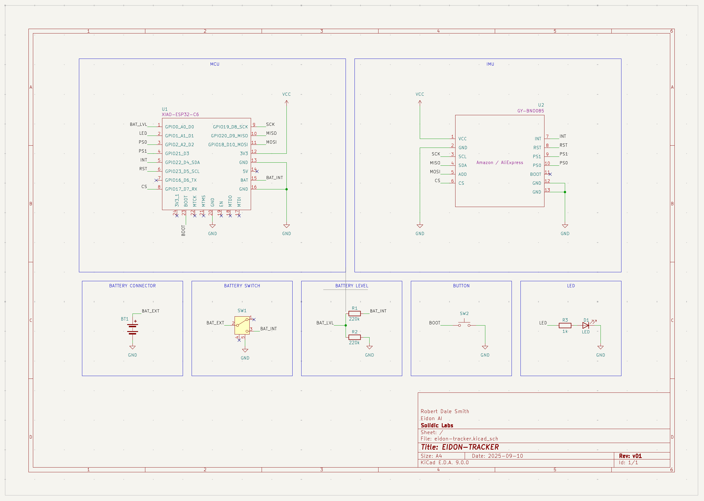

**Key functional blocks:**
- **Power Management**: LiPo battery input, voltage monitoring circuit (220kΩ voltage divider)
- **Microcontroller**: Seeed XIAO ESP32-C6 with pin assignments for I2C, GPIO, ADC
- **IMU Interface**: BNO085 I2C connection (400kHz), interrupt pin, address configuration
- **Status Indicators**: LED with current-limiting resistor, user button interface

For full resolution schematic and PCB layout files, see: `pcb/eidon-tracker/eidon-tracker.kicad_sch`

---

**Document prepared by**: Eidon Engineering Team
**Last updated**: November 2025
**Document version**: 1.0

---

