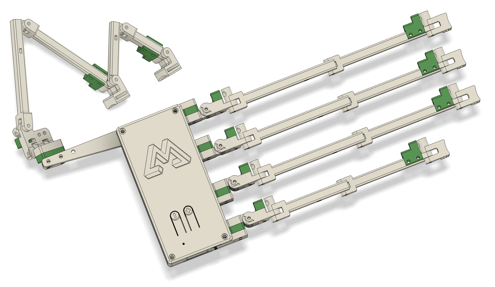
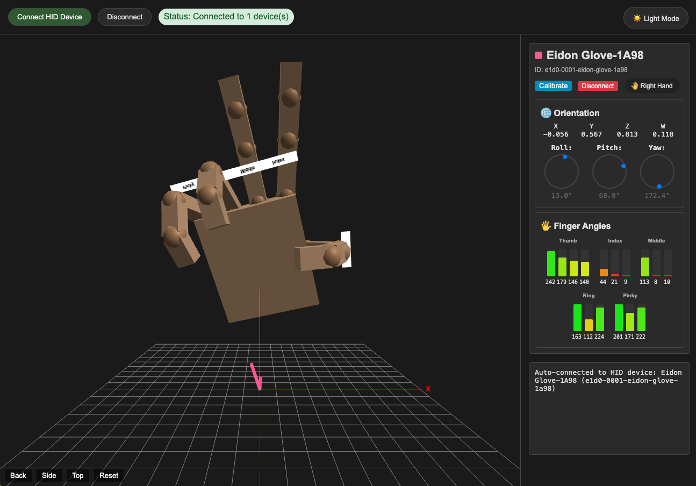

# eidon-glove

A robust 16-DOF hand/finger tracking wearable standard Bluetooth Human Interface Device (BLE HID) designed for humanoid teleoperation and collecting embodied AI training datasets.



## Features

- **16-DOF Finger Tracking**: Full hand tracking with 16 Hall effect sensors for precise joint angle measurement
- **Wireless Connectivity**: Standard BLE HID protocol (~100Hz wireless transmission)
- **Multi-Mode Support**: Generic HID and gamepad modes with custom firmware
- **9-DOF Orientation Tracking**: Optional BNO085 IMU integration (Accelerometer/Gyro/Magnetometer)
- **Custom Hardware**: Purpose-built PCB with analog multiplexer for efficient sensor management
- **ESP32-C3 MCU**: Built-in BLE, WiFi, and battery charging capabilities
- **All-Day Battery**: 3.7V 2000mAh lithium polymer battery with power management
- **Wearable Design**: Fully 3D printable exoskeleton optimized for comfort and accuracy
- **Power Management**: Integrated power switch and LED status indicators

## Hardware Architecture

### Core Components
- **Microcontroller**: Seeed XIAO ESP32-C3 (RISC-V 32-bit @ 160MHz)
- **Sensors**: 16x Hall effect sensors + magnets for joint tracking
- **IMU**: BNO085 9-DOF sensor (optional)
- **Multiplexer**: Analog multiplexer for sensor input management
- **Battery**: 3.7V 2000mAh Li-Po with ETA4054S2F charging chip

### BOM
- Seeed XIAO ESP32-C3 [[Amazon](https://amzn.to/43tHIOO)]
- Hall Effect Sensor [[Amazon](https://amzn.to/4mQyvrq)]
- BNO085 IMU Module [[Amazon](https://amzn.to/3ZKFbNI)]
- Adjustable Hand Strap [[Amazon](https://amzn.to/4mLNEds)]
- Finger Velcro Loops [[Amazon](https://amzn.to/4kuzVpS)]
- Wire Zip Ties [[Amazon](https://amzn.to/4mFPDQp)]
- M2 Screws [[Amazon](https://amzn.to/45LmPQm)]
- Lipo Battery [[Amazon](https://amzn.to/3ZLaW9m)]
- Power Switch [[Amazon](https://amzn.to/4kTvcxY)]
- Status LED [[Amazon](https://amzn.to/43XH38d)]
- JST Connectors + Wires [[AliExpress](https://www.aliexpress.us/item/3256807031812901.html)] *(only if using custom PCB)*
- Multiplexer Module [[Amazon](https://amzn.to/3HiPO4a)] *(only if **NOT** using custom PCB)*


### Pin Configuration (XIAO ESP32-C3)

| Function | GPIO | Pin Label | Notes |
|----------|------|-----------|-------|
| **Multiplexer Control** |
| S0 | 10 | D10 | Multiplexer select bit 0 |
| S1 | 9 | D9 | Multiplexer select bit 1 |
| S2 | 6 | D4 | Multiplexer select bit 2 |
| S3 | 7 | D5 | Multiplexer select bit 3 |
| **User Interface** |
| Boot Button | 9 | D9 | Built-in XIAO button |
| Mode Button | 10 | D10 | PCB-mounted button |
| Status LED | 5 | D3 | Power/status indicator |
| **BNO085 IMU (Optional)** |
| I2C SDA | 21 | D6/TX | IMU data line |
| I2C SCL | 20 | D7/RX | IMU clock line |

## BNO085 IMU Integration (Optional)

The BNO085 9-DOF IMU provides orientation tracking to complement finger position data. This is an optional component that can be added for enhanced hand tracking capabilities.

### BNO085 Wiring

**I2C Connection:**
- **SDA**: GPIO 21 (D6/TX) - I2C Data line
- **SCL**: GPIO 20 (D7/RX) - I2C Clock line  
- **VCC**: 3.3V power supply
- **GND**: Ground connection
- **I2C Address**: 0x4B (default)

**Optional Connections:**
- **RST**: Not currently implemented (software reset used instead)
- **INT**: Interrupt pin (not used in current implementation)

### Important Notes

⚠️ **Multiplexer Pin Conflicts**: The current codebase has these remaining pin assignment conflicts:

1. **Button Conflicts**: Boot button (GPIO 9) and Mode button (GPIO 10) conflict with multiplexer pins S1 and S0

### BNO085 Software Configuration

The IMU is configured for:
- **Sensor Fusion**: Game Rotation Vector mode
- **Update Rate**: 200Hz (5ms intervals)  
- **Auto-Detection**: System continues operation if IMU is not connected
- **Data Output**: Quaternion format for orientation representation

Breakout Board Recommendation:

- GY-BNO085 Module [[Amazon](https://www.amazon.com/Teyleten-Robot-BNO085-Accuracy-Nine-Axis/dp/B0CL26J81F)]

## Getting Started

### Prerequisites
- PlatformIO IDE extension
- 3D printer for mechanical components
- PCB manufacturing (or breadboard for prototyping)
- Components listed in BOM (see PCB directory)

### Build Instructions
1. Clone this repository
2. Open firmware project in PlatformIO
3. Install dependencies (automatically handled by platformio.ini)
4. Build and upload to XIAO ESP32-C3
5. Assemble mechanical components
6. Calibrate sensors using built-in calibration mode

### Firmware Dependencies
- **ResponsiveAnalogRead** ^1.2.1: Sensor input filtering  
- **NimBLE-Arduino** ^1.4.1: Bluetooth Low Energy
- **Adafruit BNO08x** ^1.2.3: IMU sensor library

## Web Hand Visualizer

The eidon-glove includes a comprehensive web-based visualizer for real-time hand tracking data visualization and analysis.



### What It Is

A browser-based 3D hand visualization tool that:
- **Real-time 3D Hand Model**: Displays a detailed 3D hand that mirrors your glove movements
- **IMU Orientation Tracking**: Shows precise hand orientation using quaternion data from the BNO085 IMU
- **16-DOF Finger Tracking**: Visualizes all finger joint movements with color-coded angle displays
- **Multi-Device Support**: Can connect to multiple gloves and trackers simultaneously
- **Data Recording & Playback**: Record hand movements and play them back for analysis

### Key Features

- **🎯 Gimbal-Lock Free**: Stable orientation tracking without axis flipping at extreme angles
- **🔄 Auto-Reconnect**: Automatically reconnects to previously paired devices on page refresh  
- **🎨 Color-Coded Visualization**: Device-specific colors for easy identification
- **📊 Real-Time Data**: Live quaternion values, Euler angles, and joint positions
- **🎮 HID Protocol**: Uses standard Web HID API for direct browser connection
- **💾 Session Recording**: Capture and save hand movement sequences

### How to Use

1. **Open the Web App**: Navigate to `/web/index.html` in a modern browser (Chrome/Edge recommended)
2. **Connect Your Glove**: Click "Connect" and select your eidon-glove from the HID device list
3. **Calibrate**: Use the "Calibrate" button to zero the sensor baseline
4. **Visualize**: Watch the 3D hand model mirror your real hand movements in real-time

### Browser Requirements

- **Chrome 89+** or **Edge 89+** (Web HID API support required)
- **HTTPS Connection** (required for Web HID API)
- **Modern GPU** (WebGL support for 3D rendering)

### Technical Details

- **Communication**: Web HID API for direct glove communication
- **3D Rendering**: Three.js for WebGL-based hand visualization  
- **Coordinate System**: Optimized quaternion mapping `(x, z, -y, w)` for stable orientation
- **Update Rate**: ~60fps visualization with real-time sensor data
- **Data Format**: 24-byte HID reports containing joint angles + quaternion data

### Files

```
web/

```

The web visualizer provides an intuitive way to validate glove functionality, debug sensor issues, and demonstrate the full capabilities of the eidon-glove system.

## Project Structure

```
eidon-glove/
├── firmware/          # ESP32-C3 firmware (PlatformIO)
│   ├── src/           # Main source code
│   ├── lib/           # Custom libraries
│   └── platformio.ini # Build configuration
├── pcb/               # KiCad PCB design files
├── cad/               # 3D printable components
├── web/               # Web interface (if applicable)
│   ├── index.html         # Main web interface
│   ├── script.js          # Core visualization logic
│   ├── style.css          # UI styling
│   ├── tetris.html    # Simple Tetris game demo
│   └── piano.html     # Simple five key piano demo
└── images/            # Documentation images
```

## Inspired By

This project builds upon excellent open-source work:
- **[Project-Homunculus](https://github.com/nepyope/Project-Homunculus)**: Original 3D models and mechanical design
- **[finger-tracker](https://github.com/max-titov/finger-tracker)**: Original firmware architecture
- **[glove-v3](https://github.com/max-titov/glove-v3)**: Current PCB design foundation

## Contributing

Contributions are welcome! Please:
1. Fork the repository
2. Create a feature branch
3. Make your changes
4. Test thoroughly
5. Submit a pull request

## License

This project is released under an open-source license. See individual component repositories for specific licensing terms.

---

**Status**: Active development - hardware tested, firmware functional, documentation in progress.
